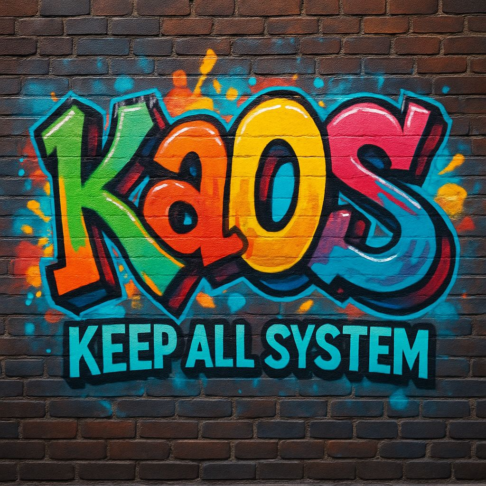

# Ka0S "Keep All 0f Systems"

Albert Einstein dijo una vez: "... si tu intención es describir la verdad, hazlo con sencillez y la elegancia déjasela al sastre."

## Table of Contents

1. Nuestra filosofía
2. ¿Qué es Ka0S?
3. ¿Y cómo me lo puedo instalar?
4. El equipo
5. ¿Y si quiero contribuir con el proyecto?
6. Licencia
7. Contacto

## Nuestra filosofía

El método **KAIZEN** engloba el concepto de la mejora continua basada en pequeñas acciones concretas, simples y poco onerosas, donde se ven implicados todos los miembros de una empresa. Nosotros hemos adaptado este método a [nuestra filosofía de trabajo](/core/docs/ka0s/ka0s.md).

## ¿Qué es Ka0S?

Si tuviésemos que explicarlo con una única frase, Ka0S sería algo así como ".... la organización fundamental de un sistema, compuesta por sus módulos, las relaciones entre ellos y su entorno, así como los principios que gobiernan su diseño y evolución."

Si entramos más en detalle, podemos decir que Ka0S es; *... es un framework, basado en código, que permite en todo momento que todos los miembros de una empresa puedan gestionar el ecosistema de herramientas, al que esta asociado Ka0S, permitiendo que en base a una reglas comunes para todos, cada uno pueda mantener y evolucionar los componentes de los cuales es responsable de una manera sencilla, simple y segura.*

Ventajas de utilizar Ka0S

- Revisión de código continuo *Permite detectar y corregir errores de manera temprana, mejorando la calidad del código.*
- Automatización de pruebas *Asegura que todas las funcionalidades se prueben de manera consistente y eficiente.*
- Refactorización Continua *Facilita la mejora constante del código sin afectar su funcionalidad.*
- Integración Continua y Entrega Continua *Permite integrar y entregar cambios de manera rápida y segura.*
- Retroalimentación y reciclaje del código *Fomenta la mejora continua a través de la retroalimentación y la reutilización de componentes.*

Si quieres saber más acerca de [Ka0s](./index.md).

## ¿Y cómo me lo puedo instalar?

Ka0s no es un simple binario que se instala, es un **Framework de Operaciones y Automatización**. Adoptar Ka0s significa integrar tu infraestructura y procesos con nuestros estándares.

### Proceso de Onboarding

Hemos automatizado el proceso de solicitud para facilitar tu integración. Sigue estos pasos:

1.  **Revisa los requisitos**: Asegúrate de tener acceso administrativo a tu organización de GitHub y, idealmente, un cluster de Kubernetes base.
2.  **Abre una solicitud**: Utiliza nuestra plantilla de **[Solicitud de Onboarding](https://github.com/Ka0s-Klaus/ka0s/issues/new?template=onboarding_request.yml)**.
    *   Esto creará un Issue estructurado donde nos proporcionarás los detalles de tu organización y entorno.
3.  **Procesamiento**:
    *   Nuestro equipo (y nuestros bots) validarán tu solicitud.
    *   Recibirás un conjunto de scripts y workflows iniciales para "bootstrapear" tu repositorio con la estructura Ka0s.

Alternativamente, si prefieres el método manual o tienes dudas específicas, puedes escribirnos a <support@ka0s.io>.

## El equipo

- **Name:** SantaKloud
  - **Role:** Lead Team - Developer - Admin Project
  - **Biography:** [Biography](https://www.linkedin.com/in/alejandrosantacanacanton/)
  - **PersonalSite:** [PersonalSite](https://santakloud.github.io/)
- **Name:** Yolanda B.N.
  - **Role:** Lead Team - Developer - Admin Project
  - **Biography:** Brief description of the team member.

## ¿Y si quiero contribuir con el proyecto?

¡Nos encanta recibir contribuciones! Ya sea reportando bugs, mejorando la documentación o escribiendo código.

Hemos definido un proceso claro para garantizar la calidad y la seguridad:

1.  **Lee nuestra Guía**: Consulta el archivo [CONTRIBUTING.md](./CONTRIBUTING.md) para entender nuestras normas de desarrollo, flujo de ramas y estándares de commits.
2.  **Reporta antes de actuar**:
    *   ¿Encontraste un error? Abre un **[Bug Report](https://github.com/Ka0s-Klaus/ka0s/issues/new?template=bug_report.yml)**.
    *   ¿Tienes una idea? Abre una **[Solicitud de Funcionalidad](https://github.com/Ka0s-Klaus/ka0s/issues/new?template=feature_request.yml)**.
3.  **Pull Requests**: Todo cambio debe pasar por un Pull Request (PR) validado por nuestros workflows de CI.

Actualmente buscamos ayuda especial en:
- Wazuh, SIEM + XDR
- Grafana, Loki, CaDvisor, Prometheus
- Kubernetes

## Releases

[Release Ka0s-Klaus](core/docs/ka0s_release/kaos-klaus.md)

## Licencia

Information about the [license](./LICENSE) under which the project is distributed.

## Contacto

Para soporte, dudas o discusiones sobre el proyecto, utiliza los canales oficiales de GitHub para mantener la trazabilidad y ayudar a otros usuarios.

- **Soporte Técnico**: Abre un [Issue](https://github.com/Ka0s-Klaus/ka0s/issues) con la etiqueta `support`.
- **Discusiones Generales**: Participa en [GitHub Discussions](https://github.com/Ka0s-Klaus/ka0s/discussions) (si está habilitado).
- **Email Corporativo**: <support@ka0s.io> (Por favor, usa `[KA0S]` en el asunto).
- **Web**: [Ka0s.io](https://www.ka0s.io)
