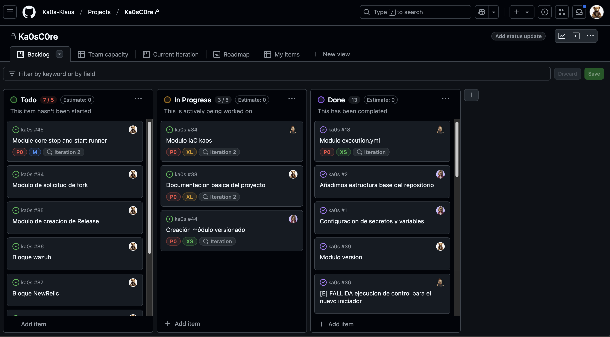

# Todo acerca de Ka0s

>- La metodología Kaizen es una filosofía de mejora continua que se compone de dos sinogramas de escritura japonesa que significan «bueno» y «cambio», y se refiere a un sistema en el que las pequeñas pero constantes mejoras acumulan grandes beneficios a largo plazo.

## Terminología

Si, parece increible pero hemos decidido en el equipo usar una terminología "especifíca" que detalla más en profundidad las diferentes parte de ka0s.

- **Atomicos**: con este término nos referimos a todos aquelllos automatismo que únicamente ejecutan una acción y que permiten ser orquestados.

- **Efímeros/as**: con este término nos referimos esas pequeñas acciones de corta, muy corta duración.

- **Iniciador**: con este término nos referimos siempre al módulo de ka0s.yml responsable de accionar el resto de mecanismos dentro de él.

- **Inspector**(audit): con este términos nos referimos a uno de los módulos que se encarga de extraer el resumen de todas y cada una de las ejecuciones que se realizan dentro de Ka0s.

- **Número Aureo (3)**: y sí, con esté término en concreto somos muy tenaces. La base de Ka0s es que en menos de tres tienes que ser capaz de obtener un resultado.

- **Laya**: con este término nos referimos a una situación dentro de Ka0s que determina que, sí él propio sistema conoce el origen del dato, dispone de todas aquellas acciones automatizadas que trabajan con el dato y dispone de un control de registro de todas las ejecuciones, hayan sido estas correctas o fallidas, Laya (asap nuestro módulo de IA) debería de poder ser capaz de contestar a cualquiera de tus preguntas sobre el propio sistema.

- **Reusar**: este es el término que nos gustar aplicar a cada diseño de los módulos core de Ka0s. Todos estan diseñados para poder ser "reusados" para generar nuevos módulos.

- **Reutilizar**: Ka0s esta diseñado, para que la estructura core y es resto de desarrollos sean dos procesos que si cambian en el tiempo permitan siempre reutilizar el código ya funcional.

- **Simple y Sencillo**: pues si, dos conceptos en uno que engloban la filosofía que permite que dentro de Ka0s (a fecha de hoy) se puedan utilizar más de [XX](https://keepcoding.io/blog/cuantos-lenguajes-de-programacion-existen/) lenguajes de programación diferentes, permitiendo a la herramienta un *flexibilidad* completa.

- **Agnóstico**: pues sí, Ka0s es muy suyo y le es indistinto para quien trabaje o a donde debe conectarse. Est diseñádo a través de variables y secretos los cuales le permiten una modularidad y una reusabilidad muy alta (+ del 75% del código core de Ka0s en totalmente reusable), lo cual nos permite facilitar una agilidad a los equipos de desarrollo que les permite reducir las líneas de código reiterativo y disminuir su tiempo de operación hasta en un 65%.

## Módulos de Ka0s

- [ka0s.yml:](./core/docs/ka0s_core/ka0s_core.md)
- inspector.yml
- version.yml
- execution.yml
- mdlint.yml
- jsonlint.yml
- yamllint.yml
- pylint.yml
- jslint.yml
- core.yml
- docker.yml
- release.yml
- summary.yml

## Nuestra metodología

Nuestra metodología de desarrallo, que no quiere decir que tenga que ser la tuya por obligación 'se explicara mas en detalle', por ende nuestra manera de trabajar se basa en que Ka0s única y exclusivamente se diseño para trabajar en "origin/main".

Explicado de manera sencilla sería algo así como " ... Ka0s dispone de una unica rama y un único "iniciador" que através del cual podemos discriminar los entornos de ejecución de las diferentes solicitudes.

¿cómo difencia Ka0s los entornos? Pues tiene un "compliance" específico definido en un fichero json que le indica para cada cambio en el número de versión cual es el entorno de ejecución. (nota: tenga en cuenta que el core de Ka0s, donde se desarrolla la solución, cuenta con varios módulos que gestiona los diferentes entornos y runners donde se ejecuta el código)

¿Ka0s v1.0.38 rc unnamed? La característica del versiona de Ka0s es la siguiente: la version de compone de un MAYOR "." un MINOR "." y un PATCH que en la equivalencia de nuestro equipo de desarrollo es algo así como:

- Un PATCH (H) hace referencia a una correccción y/o modificación de alguno de los módulos de Ka0s.
- Un MINOR (F) hace referencia a una nueva "funcionalidad" dentro del propio core de Ka0s, ya sea con un ampliación de funcionalidades de algo existente como una mejora completa o diseño un nuevo módulo.
- Un MAYOR (RN) hace referencia a que se añaden funcionalidades no existentes en "releases" anteriores.

¿Y 'rc unnamed'? Esta es la manera en la que hacemos que las diferentes versiones de Ka0s vean la luz. Cuando una versión queda completada (una v1.0.38) dentro de Ka0s hay un mecanismo automatizado para que se genere una nueva release cuyo nombre se elije aleatoriamente por el equipo de desarrollo.

Llegados a este punto nos dimos cuenta que con los mínimos recursos y variaciones disponiamos de más opciones de adaptabilidad de Ka0s a cualquiera ecosistema tecnológico y nos surgio la duda de añadir un frontal a través del cual puediesemos estar informados en todo momento de lo que ocurre dentro de Ka0s. Para lo cual decidimos diseñar un módulo que nos permitiese gestionar tanto las solicitudes de ejecución, como registrar cualquier cambio dentro de la plataforma de manera que nos permitiese usar el dashboard más sencillo que se pueda diseñar. El core de Ka0s de maneja y controla a través de la funcionalidad de gestión de Proyectos de GitHub usando un template sencillo basado en Kanban que solamente dispone de tres columnas (backlog - in progress - done).

