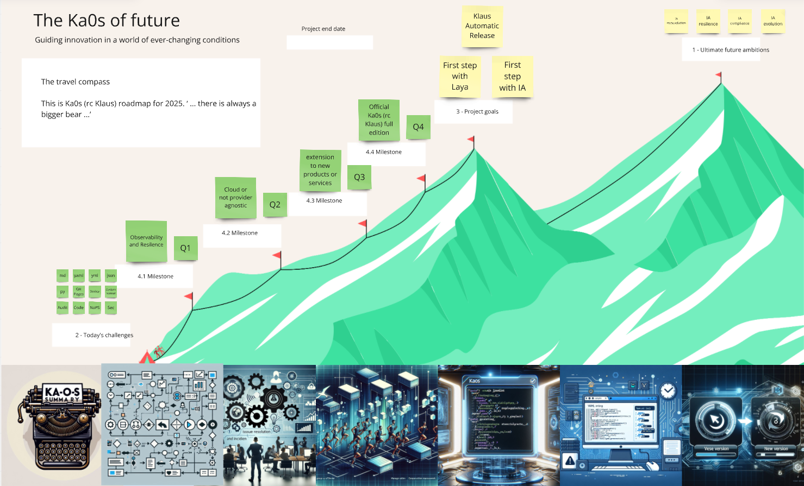

# Todo acerca de Ka0s

> - La metodología Kaizen es una filosofía de mejora continua que se compone de dos sinogramas de escritura japonesa que significan «bueno» y «cambio», y se refiere a un sistema en el que las pequeñas pero constantes mejoras acumulan grandes beneficios a largo plazo.

## Terminología

Si, parece increible pero hemos decidido en el equipo usar una terminología "especifíca" que detalla más en profundidad las diferentes parte de ka0s.

- **Atomicos**: con este término nos referimos a todos aquelllos automatismo que únicamente ejecutan una acción y que permiten ser orquestados.

- **Efímeros/as**: con este término nos referimos esas pequeñas acciones de corta, muy corta duración.

- **Iniciador**: con este término nos referimos siempre al módulo de ka0s.yml responsable de accionar el resto de mecanismos dentro de él.

- **Inspector**(audit): con este términos nos referimos a uno de los módulos que se encarga de extraer el resumen de todas y cada una de las ejecuciones que se realizan dentro de Ka0s.

- **Número Aureo (3)**: y sí, con esté término en concreto somos muy tenaces. La base de Ka0s es que en menos de tres tienes que ser capaz de obtener un resultado.

- **Laya**: con este término nos referimos a una situación dentro de Ka0s que determina que, sí él propio sistema conoce el origen del dato, dispone de todas aquellas acciones automatizadas que trabajan con el dato y dispone de un control de registro de todas las ejecuciones, hayan sido estas correctas o fallidas, Laya (asap nuestro módulo de IA) debería de poder ser capaz de contestar a cualquiera de tus preguntas sobre el propio sistema.

- **Reusar**: este es el término que nos gustar aplicar a cada diseño de los módulos core de Ka0s. Todos estan diseñados para poder ser "reusados" para generar nuevos módulos.

- **Reutilizar**: Ka0s esta diseñado, para que la estructura core y es resto de desarrollos sean dos procesos que si cambian en el tiempo permitan siempre reutilizar el código ya funcional.

- **Simple y Sencillo**: pues si, dos conceptos en uno que engloban la filosofía que permite que dentro de Ka0s (a fecha de hoy) se puedan utilizar más de [XX](https://keepcoding.io/blog/cuantos-lenguajes-de-programacion-existen/) lenguajes de programación diferentes, permitiendo a la herramienta un *flexibilidad* completa.

- **Agnóstico**: pues sí, Ka0s es muy suyo y le es indistinto para quien trabaje o a donde debe conectarse. Est diseñádo a través de variables y secretos los cuales le permiten una modularidad y una reusabilidad muy alta (+ del 75% del código core de Ka0s en totalmente reusable), lo cual nos permite facilitar una agilidad a los equipos de desarrollo que les permite reducir las líneas de código reiterativo y disminuir su tiempo de operación hasta en un 65%.

## Módulos de Ka0s

<!-- MODULES_START -->
<!-- This section is automatically generated by .github/scripts/update-docs-index.py -->

- [Módulo Ka0s (Core Orchestrator)](./ka0s/ka0s.md)
- [🗺️ Mapa de Arquitectura Ka0s](./ka0s_architecture/README.md)
- [Ka0s Kubernetes CI/CD Automation](./ka0s_ci_cd_k8s/ka0s_ci_cd_k8s.md)
- [Módulo Ka0s Cluster Update](./ka0s_cluster_update/ka0s_cluster_update.md)
- [Módulo Ka0s Core](./ka0s_core/ka0s_core.md)
- [Ka0s Daily Cluster Report](./ka0s_daily_report/ka0s_daily_report.md)
- [Módulo Ka0s Dashboard](./ka0s_dashboard/ka0s_dashboard.md)
- [Ka0s Delete Namespace Module](./ka0s_delete_ns/ka0s_delete_ns.md)
- [Módulo Ka0s Docker](./ka0s_docker/ka0s_docker.md)
- [Módulo Ka0s Execution](./ka0s_execution/ka0s_execution.md)
- [Módulo Ka0s HTML Lint](./ka0s_html/ka0s_html.md)
- [Módulo Ka0s Init](./ka0s_init/ka0s_init.md)
- [Módulo Ka0s Inspector](./ka0s_inspector/ka0s_inspector.md)
- [Módulo Ka0s iTop Integration](./ka0s_itop/ka0s_itop.md)
- [Módulo Ka0s JSON Lint](./ka0s_json/ka0s_json.md)
- [Documentación del Módulo: Ka0s Kubectl Tunnel](./ka0s_kubectl_tunnel/ka0s_kubectl_tunnel.md)
- [Módulo Ka0s Landing Zone (LZ)](./ka0s_lz/ka0s_lz.md)
- [Módulo Ka0s Markdown Lint](./ka0s_md/ka0s_md.md)
- [Módulo Ka0s MongoDB Integration](./ka0s_mongo/ka0s_mongo.md)
- [Módulo Ka0s Release (Klaus)](./ka0s_release/ka0s_release.md)
- [Módulo Ka0s Security Audit](./ka0s_security/ka0s_security.md)
- [Módulo Ka0s SSH Connect](./ka0s_ssh_connect/ka0s_ssh_connect.md)
- [Módulo Ka0s Workflow Statistics](./ka0s_summary/ka0s_summary.md)
- [Módulo Ka0s Template](./ka0s_template/ka0s_template.md)
- [Módulo Ka0s Version Manager](./ka0s_version/ka0s_version.md)
- [Módulo Ka0s YAML Lint](./ka0s_yaml/ka0s_yaml.md)
- [Ka0s Cluster Restart Module](./kaos_cluster_restart/kaos_cluster_restart.md)

<!-- MODULES_END -->

## Releases

>- [Ka0s - Klaus](./ka0s_release/kaos-klaus.md)
>- Ka0s - Proyecto D

## Nuestra metodología

La mejor manera de explicarla esta [aquí](./ka0s/ka0s_metodologia.md)
