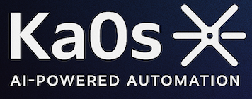
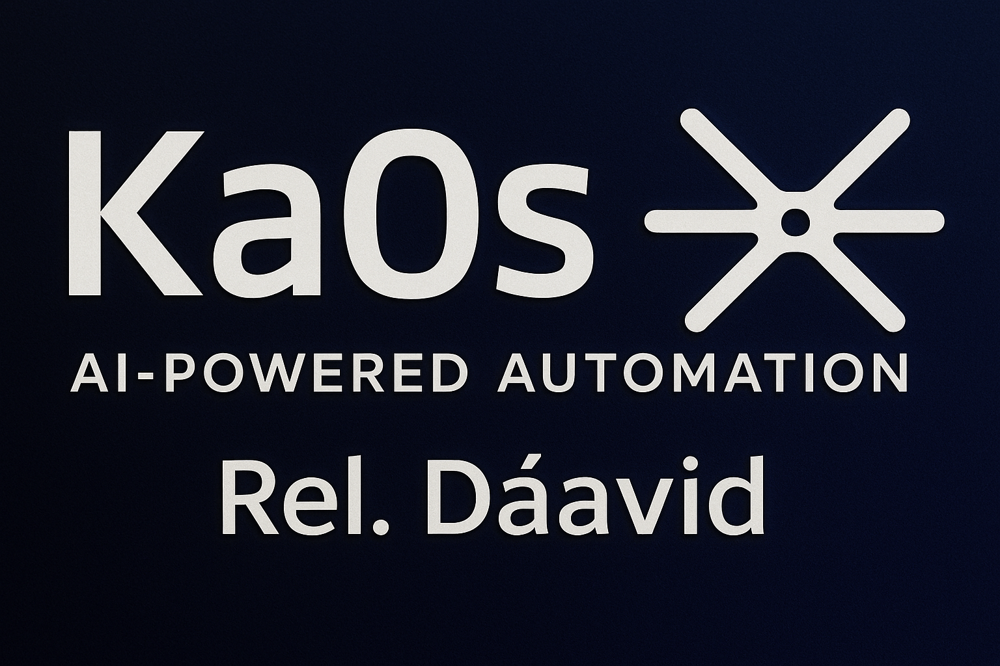
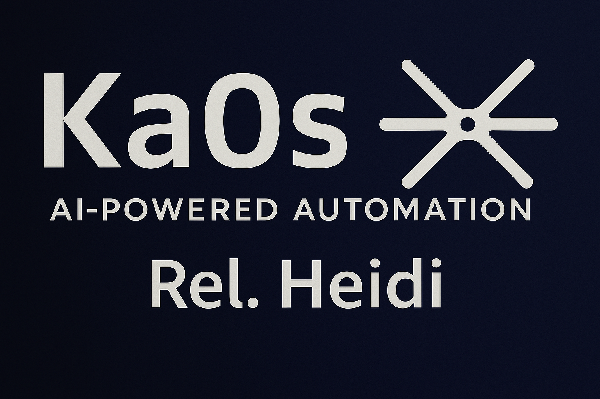
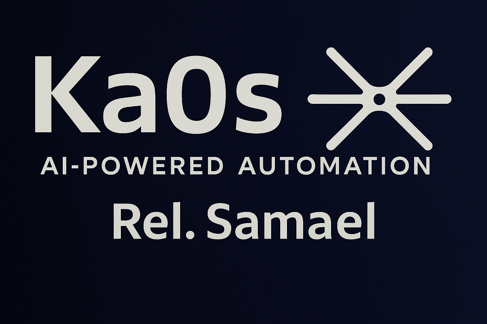

# Todo acerca de Ka0s

> - La metodología Kaizen es una filosofía de mejora continua que se compone de dos sinogramas de escritura japonesa que significan «bueno» y «cambio», y se refiere a un sistema en el que las pequeñas pero constantes mejoras acumulan grandes beneficios a largo plazo.

## Terminología

Si, parece increible pero hemos decidido en el equipo usar una terminología "especifíca" que detalla más en profundidad las diferentes parte de ka0s.

- **Atomicos**: con este término nos referimos a todos aquelllos automatismo que únicamente ejecutan una acción y que permiten ser orquestados.

- **Efímeros/as**: con este término nos referimos esas pequeñas acciones de corta, muy corta duración.

- **Iniciador**: con este término nos referimos siempre al módulo de ka0s.yml responsable de accionar el resto de mecanismos dentro de él.

- **Inspector**(audit): con este términos nos referimos a uno de los módulos que se encarga de extraer el resumen de todas y cada una de las ejecuciones que se realizan dentro de Ka0s.

- **Número Aureo (3)**: y sí, con esté término en concreto somos muy tenaces. La base de Ka0s es que en menos de tres tienes que ser capaz de obtener un resultado.

- **Laya**: con este término nos referimos a una situación dentro de Ka0s que determina que, sí él propio sistema conoce el origen del dato, dispone de todas aquellas acciones automatizadas que trabajan con el dato y dispone de un control de registro de todas las ejecuciones, hayan sido estas correctas o fallidas, Laya (asap nuestro módulo de IA) debería de poder ser capaz de contestar a cualquiera de tus preguntas sobre el propio sistema.

- **Reusar**: este es el término que nos gustar aplicar a cada diseño de los módulos core de Ka0s. Todos estan diseñados para poder ser "reusados" para generar nuevos módulos.

- **Reutilizar**: Ka0s esta diseñado, para que la estructura core y es resto de desarrollos sean dos procesos que si cambian en el tiempo permitan siempre reutilizar el código ya funcional.

- **Simple y Sencillo**: pues si, dos conceptos en uno que engloban la filosofía que permite que dentro de Ka0s (a fecha de hoy) se puedan utilizar más de [XX](https://keepcoding.io/blog/cuantos-lenguajes-de-programacion-existen/) lenguajes de programación diferentes, permitiendo a la herramienta un *flexibilidad* completa.

- **Agnóstico**: pues sí, Ka0s es muy suyo y le es indistinto para quien trabaje o a donde debe conectarse. Est diseñádo a través de variables y secretos los cuales le permiten una modularidad y una reusabilidad muy alta (+ del 75% del código core de Ka0s en totalmente reusable), lo cual nos permite facilitar una agilidad a los equipos de desarrollo que les permite reducir las líneas de código reiterativo y disminuir su tiempo de operación hasta en un 65%.

## Módulos de Ka0s

<!-- MODULES_START -->
<!-- This section is automatically generated by .github/scripts/update-docs-index.py -->

- [Ka0s Admin Agent - Diseño Técnico](./admin-agent/design.md)
- [Ka0s Kubernetes Audits](./k8s-audits/00_main.md)
- [Módulo Ka0s (Core Orchestrator)](./ka0s/00_main.md)
- [Ka0s Agent AI](./ka0s_agent_ai/00_main.md)
- [Ka0s Agent: Batería de pruebas y mejora iterativa](./ka0s_agent_eval/00_main.md)
- [Ka0s Agent: Visión y Roadmap](./ka0s_agent_future/00_main.md)
- [Ka0s Agent Ingest - Estrategia Modular](./ka0s_agent_ingest/00_main.md)
- [Ka0s Agent Knowledge Pipeline (DB Embeddings)](./ka0s_agent_knowledge_pipeline/00_main.md)
- [Ka0s AnythingLLM (Frontend de IA)](./ka0s_anythingllm/00_main.md)
- [Arquitectura: Core (Núcleo del Sistema)](./ka0s_architecture/core.md)
- [Módulo Ka0s Audit Failed Pods](./ka0s_audit_pods/00_main.md)
- [Ka0s Kubernetes CI/CD Automation](./ka0s_ci_cd_k8s/00_main.md)
- [Módulo Ka0s Cluster Update](./ka0s_cluster_update/00_main.md)
- [Módulo: Ka0s CMDB Ingestion](./ka0s_cmdb_ingest/00_main.md)
- [Módulo Ka0s CMDB Sync](./ka0s_cmdb_sync/00_main.md)
- [Módulo Ka0s Core](./ka0s_core/00_main.md)
- [Ka0s Daily Cluster Report](./ka0s_daily_report/00_main.md)
- [Módulo Ka0s Dashboard](./ka0s_dashboard/00_main.md)
- [Módulo: Ka0s DB Admin (CloudBeaver)](./ka0s_db_admin/00_main.md)
- [Ka0s Delete Namespace Module](./ka0s_delete_ns/00_main.md)
- [Módulo Ka0s Docker](./ka0s_docker/00_main.md)
- [Módulo: Ka0s Docs Portal](./ka0s_docs_portal/00_main.md)
- [Módulo Ka0s Execution](./ka0s_execution/00_main.md)
- [Módulo Ka0s GitHub → iTop Sync](./ka0s_github_sync_itop/00_main.md)
- [Ka0s GPU Enablement (Intel)](./ka0s_gpu_enablement/00_main.md)
- [Módulo Ka0s HTML Lint](./ka0s_html/00_main.md)
- [Protocolo de Verificación de Incidencias (SOP)](./ka0s_incident_response/01_issue_verification.md)
- [Módulo Ka0s Init](./ka0s_init/00_main.md)
- [Módulo Ka0s Inspector](./ka0s_inspector/00_main.md)
- [Módulo Ka0s Issue Templates](./ka0s_issue_templates/00_main.md)
- [Módulo Ka0s ITIL Sync](./ka0s_itil_sync/00_main.md)
- [Módulo Ka0s iTop Integration](./ka0s_itop/00_main.md)
- [Ka0s iTop Core Module](./ka0s_itop_core/00_main.md)
- [Módulo Ka0s JSON Lint](./ka0s_json/00_main.md)
- [Documentación del Módulo: Ka0s Kubectl Tunnel](./ka0s_kubectl_tunnel/00_main.md)
- [Módulo Ka0s Landing Zone (LZ)](./ka0s_lz/00_main.md)
- [Módulo Ka0s Markdown Lint](./ka0s_md/00_main.md)
- [Módulo Ka0s Metabase](./ka0s_metabase/00_main.md)
- [Módulo Ka0s MongoDB Integration](./ka0s_mongo/00_main.md)
- [Módulo Ka0s Onboarding](./ka0s_onboarding/00_main.md)
- [PostgreSQL IA - Servicio de Memoria Vectorial](./ka0s_postgresql_ia/00_main.md)
- [Ka0s Project Routing](./ka0s_project_routing/00_main.md)
- [Módulo Ka0s Release (Klaus)](./ka0s_release/00_main.md)
- [Ka0s Remediation Module](./ka0s_remediation/00_main.md)
- [Ka0s Remediation: High CPU/Load Workflow](./ka0s_remediation_high_load/01_concept.md)
- [`bin/`: utilidades y bootstrap](./ka0s_repo_directories/04_bin.md)
- [Ka0s: árbol completo de directorios](./ka0s_repo_directories_tree/00_main.md)
- [Reporte Diario de Lead Time](./ka0s_reports/00_main.md)
- [Ka0s Runners (ARC)](./ka0s_runners/00_main.md)
- [Módulo Ka0s Security Audit](./ka0s_security/00_main.md)
- [Documentación del Módulo: Ka0s Self Service Portal](./ka0s_self_service_portal/00_main.md)
- [Módulo Ka0s SSH Connect](./ka0s_ssh_connect/00_main.md)
- [Módulo Ka0s Workflow Statistics](./ka0s_summary/00_main.md)
- [Módulo Ka0s Template](./ka0s_template/00_main.md)
- [Módulo Ka0s Version Manager](./ka0s_version/00_main.md)
- [Watchdog - Node Health](./ka0s_watchdog_node_health/00_main.md)
- [Módulo Ka0s YAML Lint](./ka0s_yaml/00_main.md)
- [Concepto: Monitoring as Code (Zabbix IaC)](./ka0s_zabbix_iac/01_concept.md)
- [Ka0s Cluster Restart Module](./kaos_cluster_restart/00_main.md)
- [OpenClaw (Modelos Locales) - Ka0s Brain](./openclaw/00_main.md)
- [Registro de Sesión](./templates/session_log_template.md)
- [Windows Node Join Script (Template)](./windows_nodes/03_technical.md)

<!-- MODULES_END -->

## Releases

>- [Ka0s - Klaus](./ka0s_release/kaos-klaus.md)

>- [Ka0s - David (24102025) "Cooming Soon"]

>- [Ka0s - Heidi (01032026) "Cooming Soon"]

>- [Ka0s - Samael (22052026) "Cooming Soon"]
  

## Nuestra metodología

La mejor manera de explicarla esta [aquí](./ka0s/ka0s_metodologia.md)
