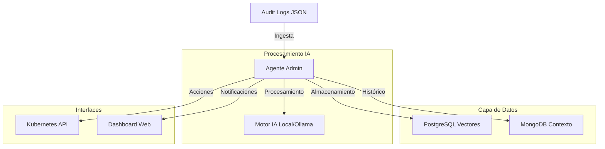
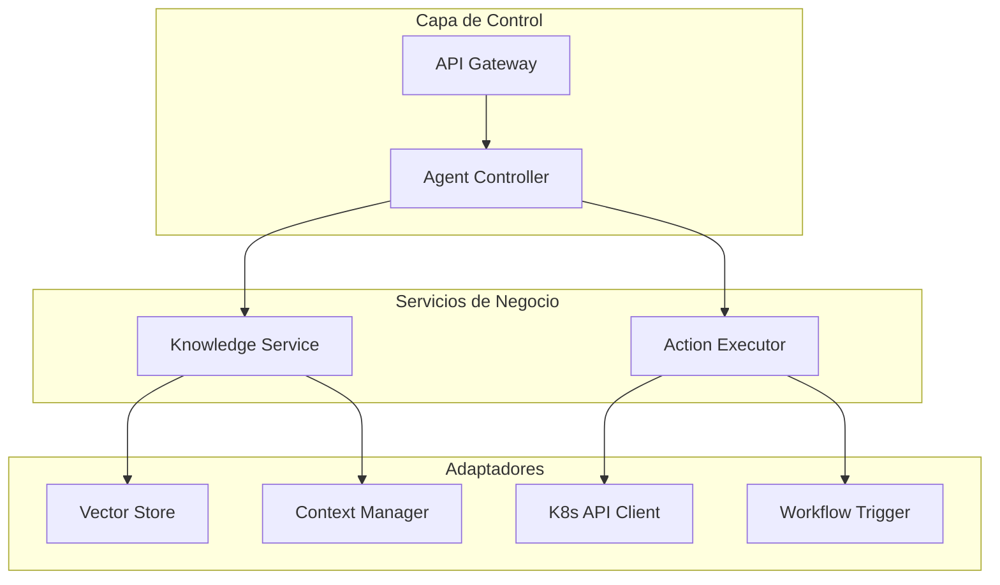
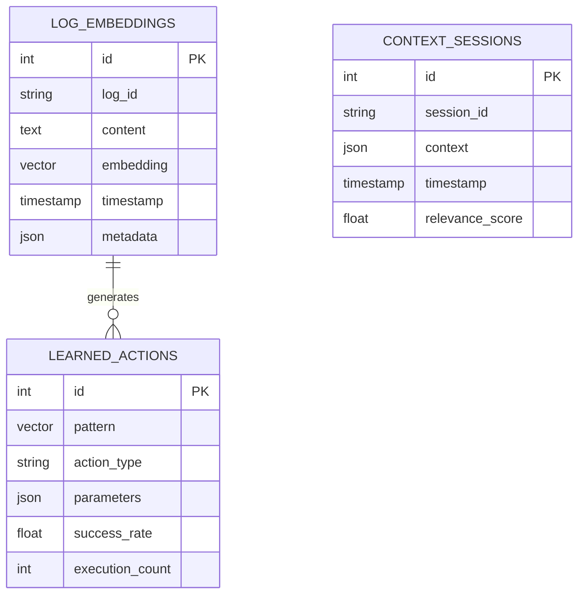

# Ka0s Admin Agent - Diseño Técnico

## 1. Arquitectura de Alto Nivel

El Agente de Administración con Memoria a Largo Plazo es un servicio inteligente que automatiza la gestión y administración del proyecto Ka0s, aprendiendo de los logs de auditoría y proporcionando asistencia proactiva en la operación del cluster Kubernetes.



## 2. Análisis de Viabilidad Hardware

### 2.1 Distribución de Recursos por Nodo

| Nodo | CPU | RAM | Almacenamiento | Rol Recomendado |
|------|-----|-----|----------------|------------------|
| Pentium IV | 1 core | 4GB | 256GB | Logs y monitorización ligera |
| i3 | 2-4 cores | 16GB | 256GB | Servicios auxiliares |
| i5 | 4 cores | 16GB | 256GB | Base de datos PostgreSQL |
| i5 Premium | 4-6 cores | 32GB | 1TB | Motor IA (Ollama) + Agente |

### 2.2 Estrategia de Optimización

- **Motor IA**: Desplegar Ollama en el nodo i5 de 32GB con modelos ligeros (Llama 2 7B o Mistral 7B)
- **PostgreSQL**: Usar el nodo i5 de 16GB para almacenamiento de vectores
- **MongoDB**: Aprovechar instalación existente para contexto histórico
- **Agente Principal**: Co-localizado con Ollama en el nodo de 32GB

## 3. Estrategia de Memoria a Largo Plazo

### 3.1 Almacenamiento de Conocimiento

**PostgreSQL (Extensión pgvector)**:
```sql
-- Tabla de embeddings de logs
CREATE TABLE log_embeddings (
    id SERIAL PRIMARY KEY,
    log_id VARCHAR(255),
    content TEXT,
    embedding VECTOR(768),
    timestamp TIMESTAMP DEFAULT NOW(),
    metadata JSONB
);

-- Tabla de acciones aprendidas
CREATE TABLE learned_actions (
    id SERIAL PRIMARY KEY,
    pattern VECTOR(768),
    action_type VARCHAR(100),
    parameters JSONB,
    success_rate FLOAT,
    execution_count INTEGER DEFAULT 0
);
```

**MongoDB**:
```javascript
// Colección de contexto histórico
{
  _id: ObjectId,
  session_id: "string",
  context: {
    cluster_state: "object",
    previous_actions: "array",
    outcomes: "object"
  },
  timestamp: ISODate,
  relevance_score: "number"
}
```

### 3.2 Flujo de Aprendizaje

1. **Ingesta**: Logs JSON desde `/audit/` → Procesamiento → Embeddings
2. **Almacenamiento**: Vectores en PostgreSQL, contexto en MongoDB
3. **Recuperación**: Búsqueda semántica de patrones similares
4. **Aprendizaje**: Actualización de acciones basadas en resultados

## 4. Stack Tecnológico

### 4.1 Componentes Principales

- **Frontend**: React 18 + TailwindCSS + Vite
- **Backend**: Python 3.11 + FastAPI
- **Motor IA**: Ollama con modelos locales
- **Bases de Datos**: PostgreSQL 15 (pgvector) + MongoDB 6.0
- **Orquestación**: Kubernetes + Kustomize
- **Monitoreo**: Integración con Zabbix existente

### 4.2 Dependencias Python

```
fastapi==0.104.1
uvicorn==0.24.0
sqlalchemy==2.0.23
psycopg2-binary==2.9.9
pymongo==4.6.0
ollama==0.1.7
langchain==0.0.350
sentence-transformers==2.2.2
numpy==1.24.3
pandas==2.1.3
kubernetes==28.1.0
```

## 5. Definición de APIs

### 5.1 API del Agente

**Estado del Agente**:
```
GET /api/agent/status
```

Response:
```json
{
  "status": "active|learning|maintenance",
  "uptime": 3600,
  "processed_logs": 1523,
  "learned_patterns": 47,
  "last_action": "2026-03-10T18:35:41Z"
}
```

**Consulta de Conocimiento**:
```
POST /api/agent/query
```

Request:
```json
{
  "query": "¿Cuándo fue la última vez que reiniciaste un pod?",
  "context_limit": 5
}
```

Response:
```json
{
  "answer": "El último reinicio de pod fue el 2026-03-10 a las 15:30:00",
  "confidence": 0.89,
  "sources": ["log_22918270469", "context_session_123"]
}
```

**Ejecutar Acción**:
```
POST /api/agent/action
```

Request:
```json
{
  "action_type": "restart_pod",
  "parameters": {
    "namespace": "default",
    "pod_name": "nginx-deployment-abc123"
  },
  "reason": "Alto consumo de memoria detectado"
}
```

## 6. Arquitectura del Servidor



## 7. Modelo de Datos

### 7.1 Esquema de Base de Datos



### 7.2 Definición de Tablas PostgreSQL

```sql
-- Habilitar extensión pgvector
CREATE EXTENSION IF NOT EXISTS vector;

-- Tabla principal de embeddings
CREATE TABLE log_embeddings (
    id SERIAL PRIMARY KEY,
    log_id VARCHAR(255) UNIQUE NOT NULL,
    content TEXT NOT NULL,
    embedding VECTOR(768),
    timestamp TIMESTAMP DEFAULT NOW(),
    metadata JSONB,
    INDEX idx_log_timestamp (timestamp),
    INDEX idx_log_embedding USING ivfflat (embedding vector_cosine_ops)
);

-- Tabla de acciones aprendidas
CREATE TABLE learned_actions (
    id SERIAL PRIMARY KEY,
    pattern VECTOR(768),
    action_type VARCHAR(100) NOT NULL,
    parameters JSONB,
    success_rate FLOAT DEFAULT 0.0,
    execution_count INTEGER DEFAULT 0,
    created_at TIMESTAMP DEFAULT NOW(),
    updated_at TIMESTAMP DEFAULT NOW()
);

-- Tabla de sesiones de contexto
CREATE TABLE context_sessions (
    id SERIAL PRIMARY KEY,
    session_id VARCHAR(255) UNIQUE NOT NULL,
    context JSONB,
    timestamp TIMESTAMP DEFAULT NOW(),
    relevance_score FLOAT
);
```

## 8. Configuración de Kubernetes

### 8.1 Namespace y Recursos

```yaml
apiVersion: v1
kind: Namespace
metadata:
  name: ka0s-admin-agent
  labels:
    ka0s.io/component: admin-agent
    ka0s.io/criticality: high
```

### 8.2 Deployment del Agente

```yaml
apiVersion: apps/v1
kind: Deployment
metadata:
  name: ka0s-admin-agent
  namespace: ka0s-admin-agent
spec:
  replicas: 1
  selector:
    matchLabels:
      app: ka0s-admin-agent
  template:
    metadata:
      labels:
        app: ka0s-admin-agent
    spec:
      nodeSelector:
        kubernetes.io/hostname: i5-32gb-node  # Nodo con más recursos
      containers:
      - name: admin-agent
        image: ka0s/admin-agent:latest
        resources:
          requests:
            memory: "2Gi"
            cpu: "1000m"
          limits:
            memory: "8Gi"
            cpu: "4000m"
        env:
        - name: OLLAMA_HOST
          value: "http://ollama-service:11434"
        - name: POSTGRES_HOST
          value: "postgresql-service"
        - name: MONGODB_HOST
          value: "mongodb-service"
        volumeMounts:
        - name: audit-logs
          mountPath: /app/audit
          readOnly: true
      volumes:
      - name: audit-logs
        hostPath:
          path: /var/log/ka0s/audit
          type: Directory
```

### 8.3 Servicio Ollama

```yaml
apiVersion: apps/v1
kind: Deployment
metadata:
  name: ollama
  namespace: ka0s-admin-agent
spec:
  replicas: 1
  selector:
    matchLabels:
      app: ollama
  template:
    metadata:
      labels:
        app: ollama
    spec:
      nodeSelector:
        kubernetes.io/hostname: i5-32gb-node
      containers:
      - name: ollama
        image: ollama/ollama:latest
        resources:
          requests:
            memory: "4Gi"
            cpu: "2000m"
          limits:
            memory: "16Gi"
            cpu: "6000m"
        ports:
        - containerPort: 11434
        volumeMounts:
        - name: ollama-models
          mountPath: /root/.ollama
      volumes:
      - name: ollama-models
        persistentVolumeClaim:
          claimName: ollama-models-pvc
```

## 9. Pasos de Implementación

### 9.1 Fase 1: Preparación de Infraestructura (Semana 1)

1. **Configurar PostgreSQL con pgvector**:
   ```bash
   # En el nodo i5 de 16GB
   sudo apt update
   sudo apt install postgresql-15-pgvector
   sudo systemctl restart postgresql
   ```

2. **Crear base de datos y usuario**:
   ```sql
   CREATE DATABASE ka0s_admin_agent;
   CREATE USER agent_user WITH PASSWORD 'secure_password';
   GRANT ALL PRIVILEGES ON DATABASE ka0s_admin_agent TO agent_user;
   ```

3. **Preparar nodo para Ollama**:
   ```bash
   # En el nodo i5 de 32GB
   sudo apt install nvidia-container-toolkit  # Si hay GPU
   docker pull ollama/ollama:latest
   ```

### 9.2 Fase 2: Despliegue de Componentes (Semana 2)

1. **Desplegar servicios de base de datos**:
   ```bash
   kubectl apply -f postgresql-config.yaml
   kubectl apply -f postgresql-deployment.yaml
   ```

2. **Desplegar Ollama**:
   ```bash
   kubectl apply -f ollama-deployment.yaml
   kubectl exec -it deployment/ollama -- ollama pull llama2:7b
   ```

3. **Desplegar el agente**:
   ```bash
   kubectl apply -f ka0s-admin-agent-deployment.yaml
   kubectl apply -f ka0s-admin-agent-service.yaml
   ```

### 9.3 Fase 3: Configuración y Entrenamiento (Semana 3)

1. **Configurar ingestión de logs**:
   ```bash
   # Crear CronJob para procesar logs
   kubectl apply -f log-ingestion-cronjob.yaml
   ```

2. **Entrenar modelo inicial**:
   ```bash
   curl -X POST http://ka0s-admin-agent/api/agent/train \
     -H "Content-Type: application/json" \
     -d '{"historical_logs_months": 3}'
   ```

3. **Configurar dashboards**:
   ```bash
   kubectl apply -f admin-agent-dashboard.yaml
   ```

### 9.4 Fase 4: Validación y Optimización (Semana 4)

1. **Pruebas de carga**:
   ```bash
   kubectl apply -f load-test-job.yaml
   ```

2. **Ajustar límites de recursos**:
   ```bash
   kubectl patch deployment ka0s-admin-agent -p '{"spec":{"template":{"spec":{"containers":[{"name":"admin-agent","resources":{"limits":{"memory":"12Gi"}}}]}}}}'
   ```

3. **Configurar alertas**:
   ```bash
   kubectl apply -f admin-agent-alerts.yaml
   ```

## 10. Monitoreo y Mantenimiento

### 10.1 Métricas Clave

- **Precisión del modelo**: >85% en predicciones de acciones
- **Tiempo de respuesta**: <2s para consultas simples
- **Memoria utilizada**: <80% en nodo de 32GB
- **Tasa de aprendizaje**: >10 patrones nuevos/día

### 10.2 Tareas de Mantenimiento

**Diarias**:
- Verificar logs de errores del agente
- Revisar métricas de precisión
- Validar conexión con bases de datos

**Semanales**:
- Reentrenar modelo con nuevos logs
- Limpiar embeddings antiguos (>90 días)
- Actualizar índices de vectores

**Mensuales**:
- Revisar y ajustar umbrales de decisión
- Optimizar consultas de base de datos
- Actualizar modelo base de Ollama

## 11. Consideraciones de Seguridad

### 11.1 RBAC y Permisos

```yaml
apiVersion: rbac.authorization.k8s.io/v1
kind: ClusterRole
metadata:
  name: ka0s-admin-agent
rules:
- apiGroups: [""]
  resources: ["pods", "services", "namespaces"]
  verbs: ["get", "list", "watch", "delete"]
- apiGroups: ["apps"]
  resources: ["deployments", "statefulsets"]
  verbs: ["get", "list", "watch", "patch"]
```

### 11.2 Secretos y ConfigMaps

```yaml
apiVersion: v1
kind: Secret
metadata:
  name: admin-agent-secrets
type: Opaque
data:
  db-password: <base64-encoded>
  jwt-secret: <base64-encoded>
  ollama-api-key: <base64-encoded>
```

## 12. Conclusión

Este diseño proporciona una solución escalable y eficiente para implementar un agente de administración inteligente dentro de las limitaciones de hardware actuales. La arquitectura permite:

- **Aprendizaje continuo** de los logs de auditoría
- **Toma de decisiones** basada en patrones históricos
- **Integración seamless** con el ecosistema Ka0s existente
- **Escalabilidad** futura cuando se disponga de más recursos

El agente actuará como un "compañero" inteligente que ayuda en la gestión diaria del cluster, proporcionando sugerencias proactivas y automatizando tareas repetitivas.