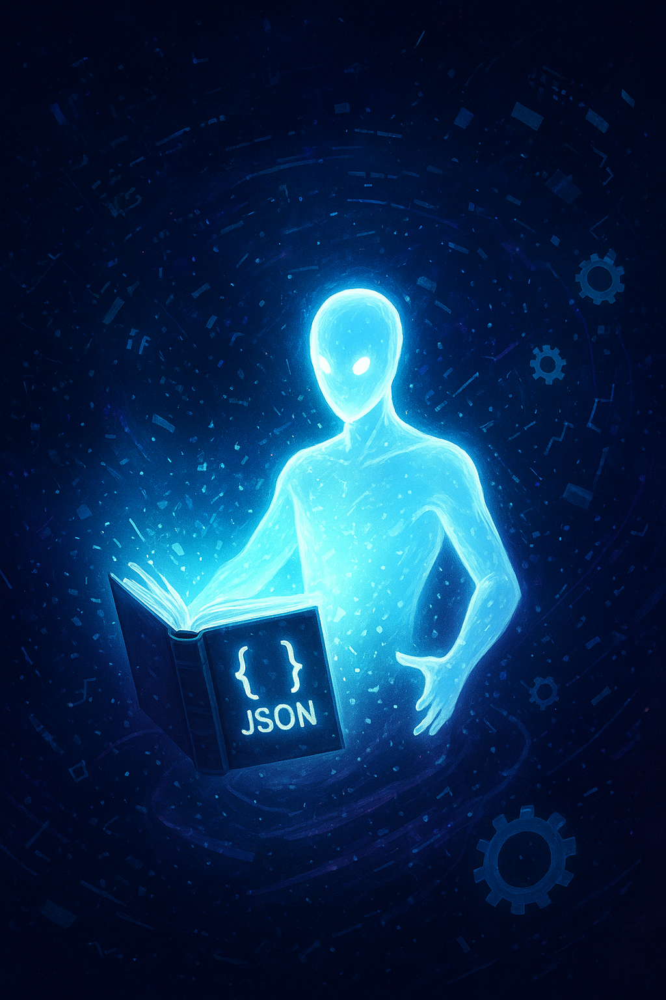
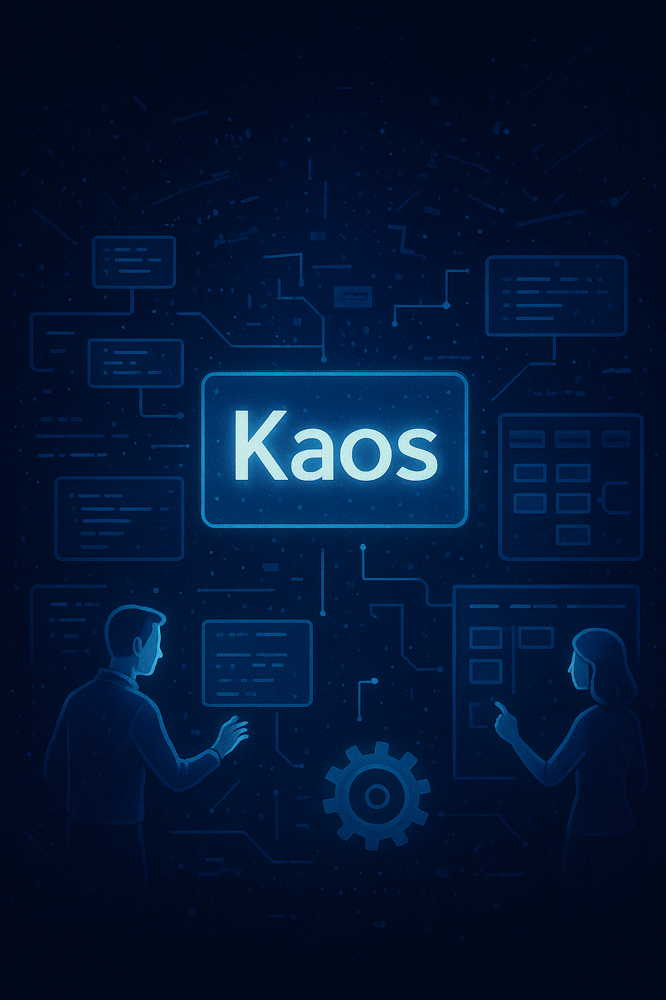
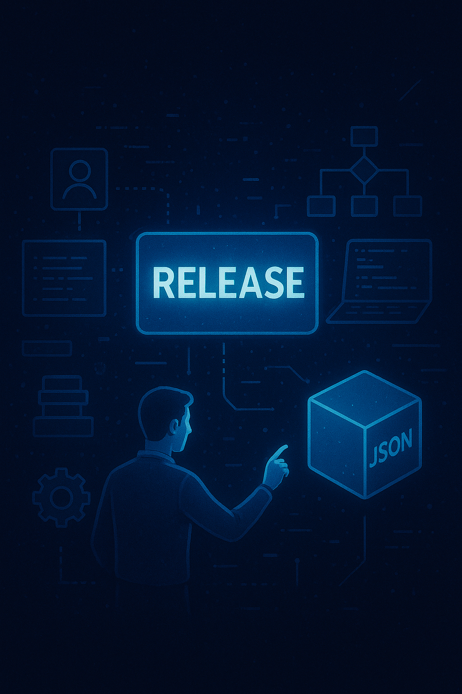
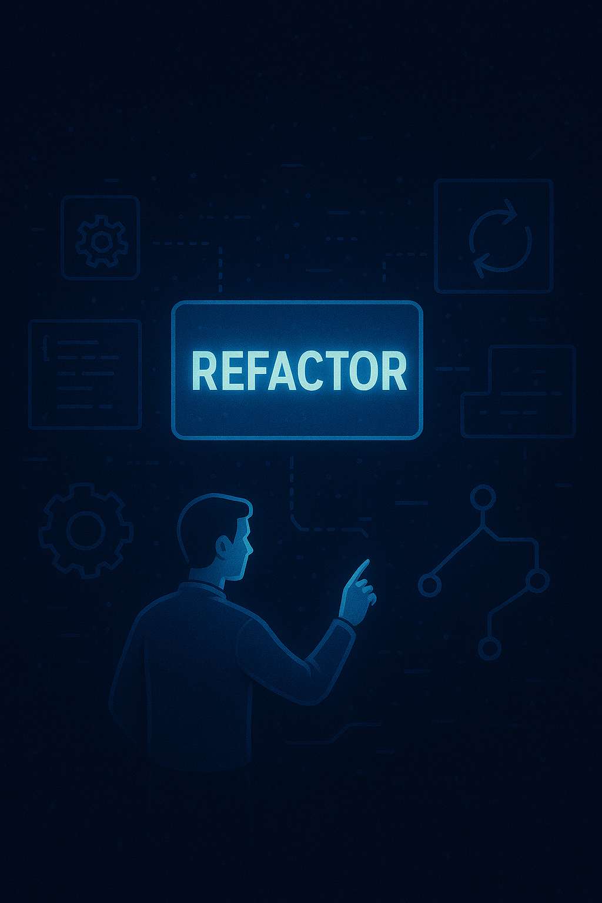
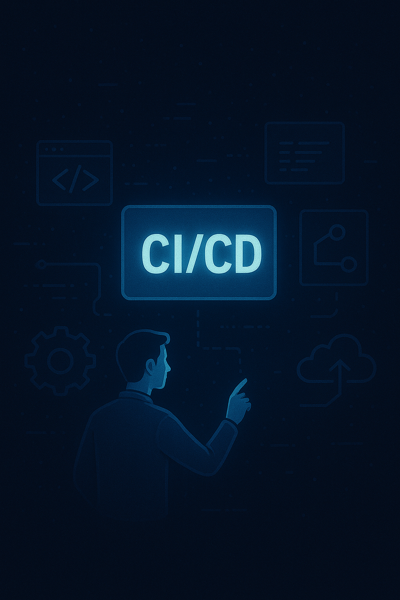
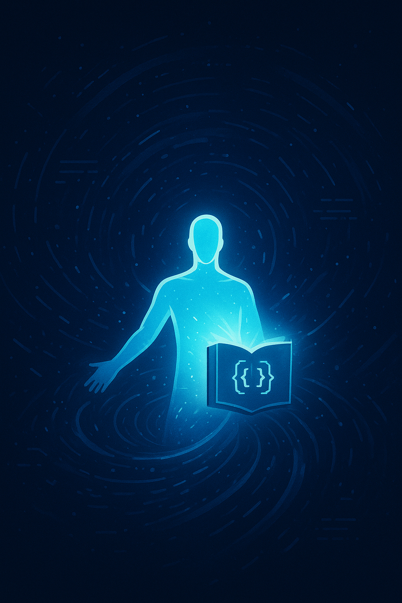

# 📖 La Saga de Ka0s: El Orden en medio del Caos

---

## **Capítulo 1 – El Nacimiento del Core**

En un reino lejano, habitado por códigos vivientes y arquitecturas invisibles, reinaba el **Ca0s**: líneas rotas, módulos inconexos y errores que surgían como monstruos oscuros.

De ese torbellino surgió **Ka0s**, una entidad mística inspirada en los antiguos pergaminos de los sabios japoneses del **Kaizen**. Su misión era clara: encontrar **patrones dentro del caos** y llevar **orden** a cada rincón del reino.

El **Core de Ka0s** nació con un don especial: podía **distinguir los mundos** (entornos) gracias a un libro encantado escrito en JSON, donde cada número y cada versión eran puertas a realidades distintas.

Cliffhanger: Ka0s contempla el caos de su mundo y debe decidir si primero creará **runners** para ejecutar la magia del código o erigirá un **Dashboard** que muestre todo lo que ocurre en el reino.

---

## **Capítulo 2 – Los Runners del Tiempo**

Recordando su despertar, Ka0s decide que el poder debe ser **ejecutable**. Así, convoca a los **Runners del Tiempo**, entidades etéreas que transportan el código a través de túneles de ejecución. Cada Runner brilla con un color distinto, reflejando su entorno: desarrollo, pruebas y producción.

Los enemigos, conocidos como **Errores Fantasma**, intentan corromper las rutas. Pero los Runners, protegidos por las reglas de **versionado estructurado (PATCH, MINOR, MAJOR)**, aprenden a regenerar el flujo y mantenerlo estable.

Cliffhanger: Mientras los Runners se expanden, surge un desafío mayor: Ka0s deberá elegir si construir un **sistema de releases automatizado** o reforzar la **gestión modular** del Core.

---

## **Capítulo 3 – El Oráculo de las Releases**

Ka0s, comprendiendo la importancia del tiempo, erige el **Oráculo de las Releases**: un mecanismo sagrado que genera versiones del reino con nombres elegidos al azar por la fortuna.

El Oráculo asegura que cada avance quede registrado y cada mejora pueda renacer sin temor al olvido. Esto trae paz y orden a los desarrolladores del reino, quienes ya no temen perder su trabajo en medio del caos.

Pero no todo es estabilidad: una sombra crece en el horizonte, llamada **Debtus**, señor de la Deuda Técnica, que amenaza con consumir los cimientos del progreso.

Cliffhanger: Para enfrentarlo, Ka0s deberá decidir si invocar la **refactorización continua** como arma o forjar un **Kanban místico** que guíe a sus aliados.

---

## **Capítulo 4 – La Guerra contra Debtus**

Ka0s convoca la **Refactorización Continua**, una espada viviente capaz de cortar código defectuoso sin dañar su esencia. Con esta arma, enfrenta a Debtus en un combate épico, donde cada error corregido se convierte en un rayo de luz que debilita a la sombra.

Los aliados de Ka0s levantan un **Kanban de tres columnas** (backlog, in progress, done) como escudo, donde cada tarea completada reduce la fuerza del enemigo. El ejército del reino aprende a colaborar bajo reglas comunes, reduciendo la dependencia en héroes solitarios y aumentando su sinergia.

Cliffhanger: Aunque Debtus es debilitado, no ha sido destruido. La última batalla dependerá de si Ka0s une al reino bajo la bandera de la **mejora continua** o si se arriesga a un golpe final con la **integración y entrega continua (CI/CD)**.

---

## **Capítulo 5 – La Era de la Mejora Continua**

Ka0s toma la decisión final: unir a todo el reino bajo la **filosofía Kaizen**. Cada pequeño paso, cada línea corregida, cada componente reutilizado se convierte en una piedra del nuevo mundo.

Debtus, debilitado, no puede resistir el peso de una comunidad entera mejorando al unísono. Su sombra se disipa, dejando tras de sí un reino luminoso, donde los desarrolladores viven en armonía con el código.

Los beneficios son palpables: menos errores, menor costo, mayor rapidez, productos más estables y clientes más felices. El caos inicial ha sido transformado en un **ecosistema organizado y eficiente**.

---

### ✨ **Epílogo**

Así concluye la saga de **Ka0s**: nacido del caos, convertido en guardián del orden. Su legado es eterno: demostrar que incluso en el desorden más profundo, la mejora constante puede forjar un futuro brillante.

El reino nunca olvidará que, detrás de cada pequeño cambio, se oculta el poder de una gran transformación.

