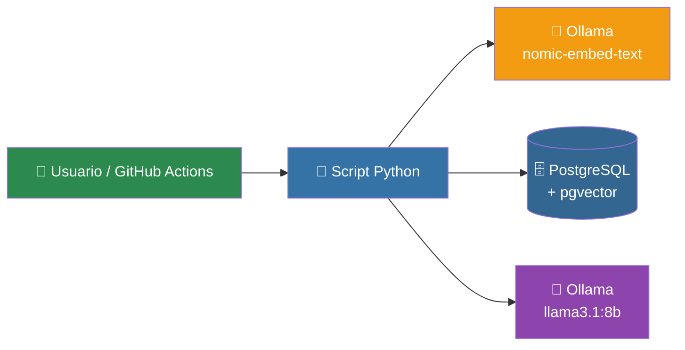
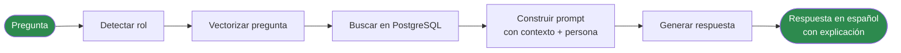
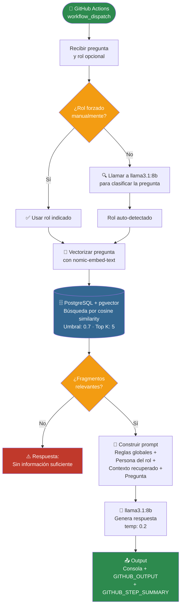
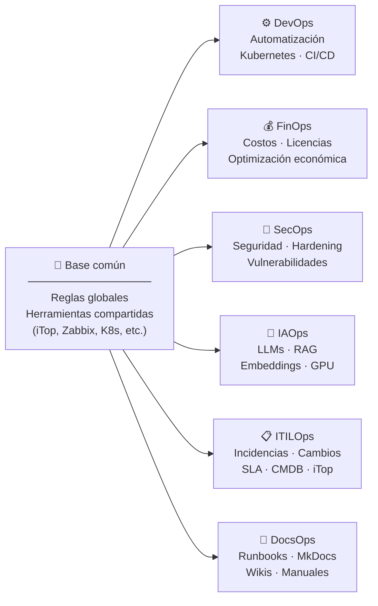
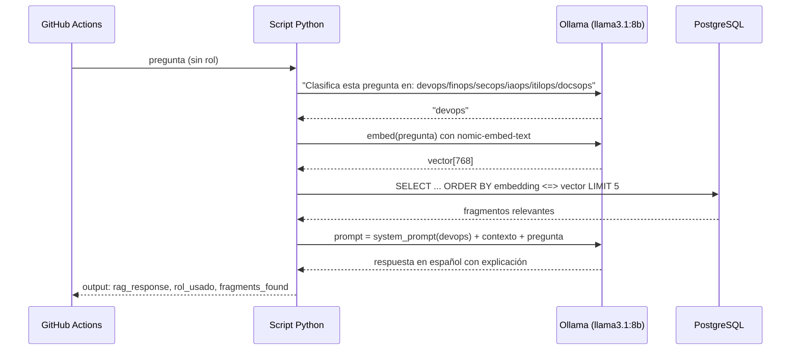
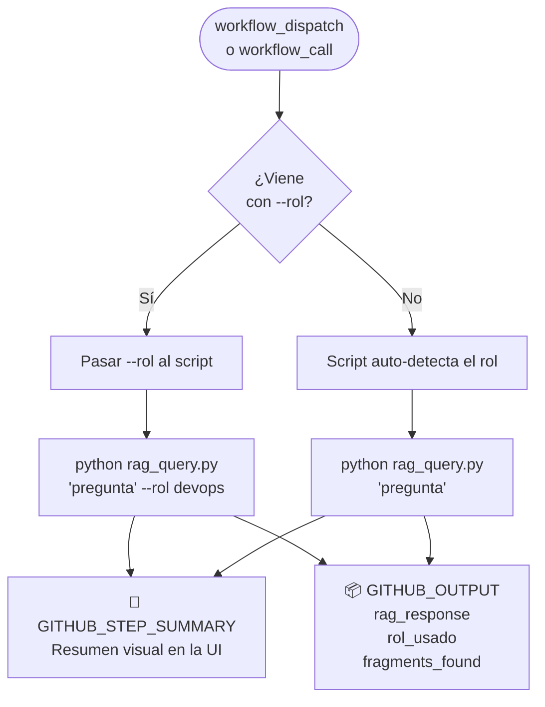
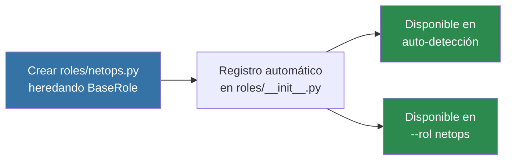

# 🤖 Arquitectura RAG Multi-Persona

> Documentación técnica del sistema de agente conversacional con recuperación aumentada de información,
> roles especializados y pipeline integrado con GitHub Actions.

-----

## Índice

1. [¿Qué es RAG?](#1-qué-es-rag)
1. [Componentes del sistema](#2-componentes-del-sistema)
1. [Flujo general](#3-flujo-general)
1. [Flujo detallado del pipeline](#4-flujo-detallado-del-pipeline)
1. [Sistema de roles (Multi-Persona)](#5-sistema-de-roles-multi-persona)
1. [Flujo de auto-detección de rol](#6-flujo-de-auto-detección-de-rol)
1. [Reglas globales y conocimiento compartido](#7-reglas-globales-y-conocimiento-compartido)
1. [Integración con GitHub Actions](#8-integración-con-github-actions)
1. [Estructura del script Python](#9-estructura-del-script-python)
1. [Cómo ampliar el sistema](#10-cómo-ampliar-el-sistema)

-----

## 1. ¿Qué es RAG?

**RAG (Retrieval-Augmented Generation)** es una arquitectura que combina dos capacidades:

- **Recuperación**: buscar fragmentos relevantes en una base de datos de conocimiento
- **Generación**: usar un LLM para producir una respuesta basada en ese conocimiento

La clave es que **separa el conocimiento de la inteligencia**:

|Componente             |Aporta                                         |
|-----------------------|-----------------------------------------------|
|Base de datos vectorial|Conocimiento actualizado y verificable         |
|LLM                    |Capacidad de razonar y generar lenguaje natural|

Sin RAG, el LLM solo responde con lo que aprendió durante su entrenamiento.
Con RAG, consulta documentos reales antes de responder.

### Problema que resuelve

```
Sin RAG:  Pregunta → LLM → Respuesta (puede alucinar o estar desactualizada)
Con RAG:  Pregunta → Buscar contexto → LLM + contexto → Respuesta fundamentada
```

-----

## 2. Componentes del sistema



|Componente                 |Tecnología                   |Función                                 |
|---------------------------|-----------------------------|----------------------------------------|
|**LLM**                    |`llama3.1:8b` vía Ollama     |Genera las respuestas                   |
|**Embedding**              |`nomic-embed-text` vía Ollama|Vectoriza textos y preguntas            |
|**Base de datos vectorial**|PostgreSQL + pgvector        |Almacena y busca por similitud semántica|
|**Pipeline**               |Python 3.11                  |Orquesta todo el flujo RAG              |
|**Orquestador**            |GitHub Actions               |Dispara las consultas al agente         |

-----

## 3. Flujo general



-----

## 4. Flujo detallado del pipeline



-----

## 5. Sistema de roles (Multi-Persona)

El sistema soporta **6 roles especializados**. Cada rol tiene su propio enfoque,
tono y reglas específicas, pero todos comparten las reglas globales y el conocimiento
de herramientas.



### Descripción de roles

|Rol      |Emoji|Especialidad                                      |Formato de respuesta     |
|---------|-----|--------------------------------------------------|-------------------------|
|`devops` |⚙️    |Infraestructura, Kubernetes, CI/CD, automatización|Pasos + bloques de código|
|`finops` |💰    |Costos, presupuesto, ROI, licencias               |Tablas comparativas      |
|`secops` |🔐    |Seguridad, hardening, vulnerabilidades, accesos   |Advertencias + checklist |
|`iaops`  |🤖    |LLMs, RAG, embeddings, inferencia, GPU            |Técnico con parámetros   |
|`itilops`|📋    |ITIL v4, gestión de incidencias, cambios, SLA     |Proceso + prioridad      |
|`docsops`|📝    |Documentación, runbooks, MkDocs, wikis            |Markdown estructurado    |

-----

## 6. Flujo de auto-detección de rol

Cuando no se fuerza un rol, el LLM clasifica la pregunta antes de responderla.
Esto supone **dos llamadas a Ollama**: una para clasificar y otra para responder.



-----

## 7. Reglas globales y conocimiento compartido

### Reglas globales

Se aplican a **todos los roles** sin excepción:

1. ✅ Responder siempre en **español**
1. ✅ Incluir sección `📌 Explicación de la solución` al final
1. ✅ Si no hay contexto suficiente: `⚠️ No tengo información suficiente...`
1. ✅ Nunca inventar datos, comandos ni configuraciones
1. ✅ Advertir con `⚠️ PRECAUCIÓN:` antes de acciones destructivas

### Herramientas que dominan todos los roles

|Herramienta   |Tipo                                        |
|--------------|--------------------------------------------|
|**iTop**      |CMDB y gestión de servicios IT              |
|**Metabase**  |Dashboards y analítica de datos             |
|**MongoDB**   |Base de datos documental NoSQL              |
|**MySQL**     |Base de datos relacional                    |
|**PostgreSQL**|Base de datos relacional avanzada + pgvector|
|**Zabbix**    |Monitorización de infraestructura           |
|**Kubernetes**|Orquestación de contenedores                |
|**MkDocs**    |Documentación técnica en Markdown           |

-----

## 8. Integración con GitHub Actions



### Secrets requeridos en el repositorio

|Secret       |Valor                                                |
|-------------|-----------------------------------------------------|
|`OLLAMA_URL` |URL interna de Ollama (ej: `http://ollama-svc:11434`)|
|`PG_HOST`    |Host de PostgreSQL                                   |
|`PG_PORT`    |Puerto (por defecto `5432`)                          |
|`PG_DB`      |Nombre de la base de datos                           |
|`PG_USER`    |Usuario                                              |
|`PG_PASSWORD`|Contraseña                                           |


> ⚠️ El runner debe ser **self-hosted** para tener acceso a Ollama y PostgreSQL internos.

-----

## 9. Estructura del script Python

```
rag_query.py
│
├── CONFIGURACIÓN          ← Variables de entorno (Ollama, PostgreSQL)
├── ROLES_VALIDOS          ← Lista de roles permitidos
│
├── CONOCIMIENTO_HERRAMIENTAS  ← Inyectado en TODOS los roles
├── REGLAS_GLOBALES            ← Inyectado en TODOS los roles
│
├── PERSONAS               ← Diccionario con los 6 roles
│   ├── devops
│   ├── finops
│   ├── secops
│   ├── iaops
│   ├── itilops
│   └── docsops
│
├── detectar_rol()         ← Paso 1: clasifica la pregunta (si no hay rol forzado)
├── embed_query()          ← Paso 2: vectoriza la pregunta con nomic-embed-text
├── search_context()       ← Paso 3: busca fragmentos en PostgreSQL/pgvector
├── build_prompt()         ← Paso 4: construye el prompt con persona + contexto
├── generate_answer()      ← Paso 5: genera la respuesta con llama3.1:8b
│
└── main()                 ← Orquesta los 5 pasos + outputs para GitHub Actions
```

### Uso desde línea de comandos

```bash
# Auto-detección de rol
python rag_query.py "¿Por qué falla el pod en CrashLoopBackOff?"

# Rol forzado
python rag_query.py "¿Cuánto cuesta este clúster?" --rol finops
python rag_query.py "Documenta el proceso de despliegue" --rol docsops
python rag_query.py "¿Hay alguna vulnerabilidad en este endpoint?" --rol secops
```

-----

## 10. Cómo ampliar el sistema

### Añadir un nuevo rol



### Añadir una nueva herramienta

```python
# En CONOCIMIENTO_HERRAMIENTAS, añadir una línea:
CONOCIMIENTO_HERRAMIENTAS = """
...
- NuevaHerramienta: descripción breve de para qué sirve
"""
```

Todos los roles la conocerán automáticamente.

### Añadir una nueva regla global

```python
# En REGLAS_GLOBALES, añadir una línea numerada:
REGLAS_GLOBALES = """
...
6. Nueva norma que aplica a todos los roles
"""
```

-----

*Documento generado automáticamente · Actualizar tras cada cambio en `rag_query.py`*