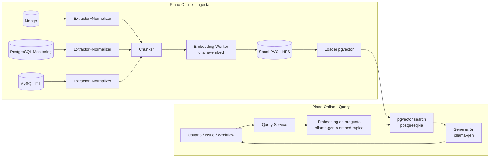

# Concepto: Knowledge Pipeline desacoplado

## Contexto

El repositorio `ka0s` ya dispone de:

- **Ollama** como servicio de modelos: `core/b2b/core-services/ollama/`.
- **Vector DB** en PostgreSQL con pgvector: `core/b2b/core-services/postgresql-ia/`.
- Workflows de consulta/ingesta de ficheros del repo:
  - `.github/workflows/kaos-agent-query.yaml`
  - `.github/workflows/kaos-agent-issue-responder.yaml`
  - `.github/workflows/kaos-agent-ingest.yaml`

El objetivo de esta arquitectura es **no heredar** el pipeline actual de ingesta por ficheros para el caso de bases de datos, sino crear un subsistema separado con:

- recursos dedicados,
- prioridades claras,
- y un flujo batch (spool + loader) que no impacte en el agente.

## Problema

Vectorizar bases de datos completas (Mongo/Postgres/MySQL) puede tardar horas y consume CPU/IO/red. Si embeddings y query comparten:

- el mismo servicio de Ollama,
- y el mismo Postgres (pgvector),

las consultas del agente sufren latencia o fallos.

## Solución: 3 planos

1. **Plano de Consulta (Online)**
   - Embedding de la pregunta + retrieval pgvector + generación de respuesta.
   - Recursos prioritarios y estables.

2. **Plano de Ingesta (Offline)**
   - Jobs batch largos con límites estrictos.
   - Normalización + chunking + embeddings.

3. **Plano de Carga (Offline, controlado)**
   - Inserción por lotes a `postgresql-ia`.
   - Idempotencia, versionado y checkpoints.

## Componentes

### A) Servicios de modelos

- **`ollama-gen`**: servicio de generación (GPU, baja latencia).
- **`ollama-embed`**: servicio de embeddings (CPU, throughput).

Rationale: aislar el tráfico masivo de embeddings del tráfico interactivo de generación.

### B) Jobs por fuente (extract/normalize/chunk)

- `extract-mongo`
- `extract-postgresql-monitoring`
- `extract-mysql-itil`

Cada extractor produce unidades canónicas: `DocumentChunk`.

### C) Embedding Worker

- consume `DocumentChunk`, llama a `ollama-embed`, escribe `VectorRecord` en spool.

### D) Loader pgvector

- consume `VectorRecord` desde spool y ejecuta UPSERT en `postgresql-ia`.

### E) Spool (almacenamiento temporal)

- PVC sobre NFS (`nf-server` en `k8-node-40`).
- Estructura:
  - `spool/<source>/<run_id>/chunks.jsonl`
  - `spool/<source>/<run_id>/vectors.parquet|jsonl`
  - `spool/<source>/<run_id>/manifest.json`

## Flujos

## Principios

- **Aislamiento**: ingestión nunca comparte GPU ni prioridad con generación.
- **Idempotencia**: re-ejecutar una ingesta no duplica vectores.
- **Incrementalidad**: re-embeddings solo para cambios.
- **Versionado**: embeddings trazables por `model`, `dim`, `normalizer_version`, `chunker_version`.

