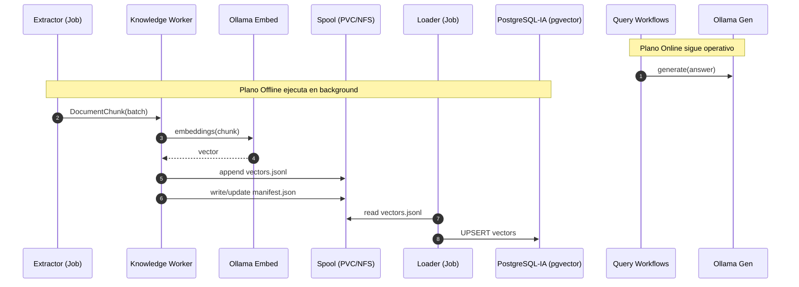

# Diseño Técnico (Arquitectura Completa)

## Resumen Ejecutivo

Se propone un subsistema de ingesta de conocimiento desde bases de datos en dos fases (**spool → load**), con **aislamiento de recursos** (modelo de generación en GPU vs embeddings en CPU) y con **prioridad operativa** para que el agente siga respondiendo durante ingestiones largas.

## Topología del Cluster

- `k8-manager` (16GB RAM, GPU): solo workloads que requieran GPU (agentes/generación).
- `k8-node-20` (32GB RAM): servicios generales y parte de datos.
- `k8-node-30` (16GB RAM): varias bases de datos.
- `k8-node-40` (Pentium IV): Zabbix + `nf-server` (almacenamiento compartido).

## Componentes Kubernetes (Propuestos)

### Namespaces

- `ollama` (existente): servicio de modelos.
- `postgresql-ia` (existente): vector DB.
- `ka0s-knowledge` (nuevo): extractores, workers y loader.

### Servicios de Modelos

#### 1) `ollama-gen` (GPU, online)

- Finalidad: `api/generate` y, opcionalmente, embedding de preguntas.
- Scheduling:
  - `nodeSelector: k8-manager`
  - `tolerations`/`affinity` para asegurar exclusividad.
- Recursos: reservar GPU y CPU suficiente.

#### 2) `ollama-embed` (CPU, offline)

- Finalidad: `api/embeddings` a alto throughput.
- Scheduling:
  - `nodeSelector: k8-node-20` (o `k8-node-30` si se prefiere cercanía a BDs).
- Recursos:
  - límites estrictos para no degradar el resto de servicios.

```mermaid
flowchart TB
  subgraph k8-manager[Node: k8-manager (GPU)]
    OG[Deployment: ollama-gen]
  end
  subgraph k8-node-20[Node: k8-node-20]
    OE[Deployment: ollama-embed]
    KW[Deploy: knowledge-worker]
  end
  subgraph k8-node-30[Node: k8-node-30]
    DBP[(PostgreSQL Monitoring)]
    DBM[(MongoDB)]
    DBI[(MySQL ITIL)]
  end
  subgraph k8-node-40[Node: k8-node-40]
    NFS[(nf-server / NFS)]
    ZBX[(Zabbix)]
  end

  KW --> OE
  KW --> NFS
```

## Data Model en PostgreSQL-IA (pgvector)

### Requisitos

- Soportar múltiples fuentes.
- Soportar incrementalidad.
- Soportar versionado de embeddings.
- Soportar idempotencia (sin duplicados por reintentos).

### Tabla recomendada

- `kaos_memory` (o tabla nueva `kaos_vectors` si se prefiere separación).

Campos mínimos recomendados:

- `source` (ej. `mongo`, `postgresql-monitoring`, `mysql-itil`)
- `record_id` (id estable en la fuente: `_id`, PK, etc.)
- `chunk_id` (número incremental dentro del record)
- `content` (texto del chunk)
- `content_hash` (hash estable del contenido normalizado del chunk)
- `embedding` (`vector(<dim>)`)
- `embedding_model` (ej. `nomic-embed-text`)
- `embedding_dim` (ej. `768`)
- `normalizer_version`, `chunker_version`
- `created_at`, `updated_at`

Índices:

- Único: `(source, record_id, chunk_id, embedding_model)`
- Btree: `(source, updated_at)`
- Vectorial: HNSW o IVFFLAT sobre `embedding`

## Pipeline: Spool → Load

### Formatos en Spool

1. `manifest.json`
   - `run_id`, `source`, `mode`
   - versiones (`model`, `normalizer`, `chunker`)
   - métricas (conteos, errores)

2. `vectors.jsonl` (mínimo viable)
   - una línea por chunk
   - contiene `source`, `record_id`, `chunk_id`, `content`, `content_hash`, `embedding`, `embedding_model`

### Etapas



## Incrementalidad (por fuente)

### MongoDB (auditoría)

Opciones:

1. **Change Streams** (preferido)
   - baja latencia y exactitud.
2. **Watermark por `updatedAt` + hash**
   - si no hay Change Streams, usar timestamp + `content_hash`.

### PostgreSQL (monitorización)

- Watermark por `updated_at` o por tabla particionada por fecha.
- Evitar full scans diarios.

### MySQL (ITIL)

- Watermark por `updated_at`.
- Normalización con allowlist de campos.

## Garantía de “No interferencia”

### Aislamiento de CPU/GPU

- `ollama-gen` en `k8-manager` con GPU.
- `ollama-embed` en nodos CPU.

### Priorización

- Crear `PriorityClass`:
  - `kaos-online-high` para query.
  - `kaos-offline-low` para ingestas.

### Concurrencia

- Un solo Job de ingesta por fuente a la vez.
- Loader separado y controlado.

## Integración con los workflows existentes

### Query

Los workflows:

- `.github/workflows/kaos-agent-query.yaml`
- `.github/workflows/kaos-agent-issue-responder.yaml`

deben apuntar a `OLLAMA_HOST` de `ollama-gen`.

### Ingest actual (repo files)

`kaos-agent-ingest.yaml` puede mantenerse para ficheros del repo, pero la ingesta de BDs debe estar en `ka0s-knowledge`.

## Seguridad

- Secrets por namespace:
  - `mongo-secret`, `postgresql-secret`, `mysql-secret`.
- El spool no contiene credenciales.
- Política: minimizar campos sensibles (ITIL) y soportar redacción.

## Riesgos y mitigaciones

- Crecimiento de `postgresql-ia`: añadir índice vectorial y dimensionar RAM.
- Backpressure en embeddings: rate limit y reintentos exponenciales.
- Spool saturado: rotación por `run_id` y retención.

