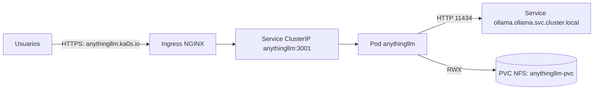

# Concepto y arquitectura (AnythingLLM)

## Visión general

AnythingLLM se despliega como una aplicación web self-hosted para:

- Chat y gestión de workspaces.
- Ingesta de documentos y RAG.
- Integraciones/funcionalidades habilitadas desde su propia UI, manteniendo el despliegue siempre en la imagen `latest` del fabricante.

En Ka0s, AnythingLLM se utiliza como **frontal** y delega generación/embeddings a **Ollama**.

## Arquitectura (flujo)

## Restricciones y decisiones

- Nodo dedicado: AnythingLLM se fija a `k8-node-20` para concentrar el consumo en el nodo con más recursos.
- Concurrencia esperada: equipo de hasta 10 personas y máximo 3 concurrentes.
- Control de presión en entrada: el Ingress de AnythingLLM incluye límites básicos de conexión/rate.

## Nota sobre “plugins”

AnythingLLM evoluciona sus integraciones y capacidades por versión. En este despliegue se garantiza:

- Imagen `mintplexlabs/anythingllm:latest` para traer las funcionalidades más recientes.
- Persistencia en almacenamiento para que la configuración y workspaces sobrevivan a recreaciones del pod.

La activación/uso de integraciones se gestiona desde la UI de AnythingLLM y puede requerir configuración adicional según el tipo de integración.
