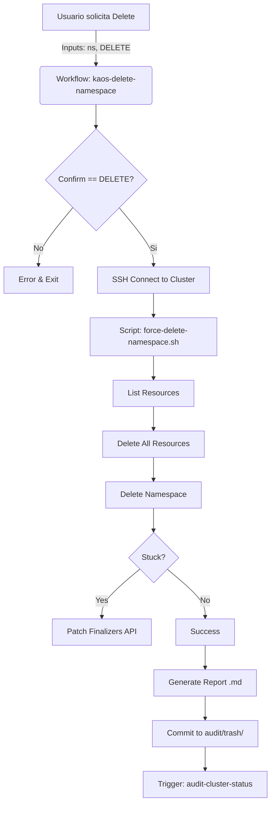

# Integración Técnica

## Flujo de Ejecución



## Detalles del Script (`force-delete-namespace.sh`)

El script utiliza una estrategia de "Tierra Quemada" controlada:

1.  **Wait Loop Inteligente**: Intenta un borrado ordenado (`kubectl delete ns`) y espera hasta 60 segundos.
2.  **Circuit Breaker**: Si tras 60s el namespace sigue existiendo (estado `Terminating`), asume un bloqueo por finalizers (común en CRDs o PVCs huérfanos).
3.  **API Raw Patch**: Ejecuta una llamada directa a la API de Kubernetes para vaciar el array de `finalizers`, lo que fuerza al Garbage Collector a eliminar el objeto inmediatamente.

```bash
kubectl replace --raw "/api/v1/namespaces/$NAMESPACE/finalize" -f -
```

## Integración con CI/CD
Este workflow puede ser invocado por otros pipelines de CI/CD (usando `workflow_call`) para limpiar entornos efímeros después de pruebas E2E.
