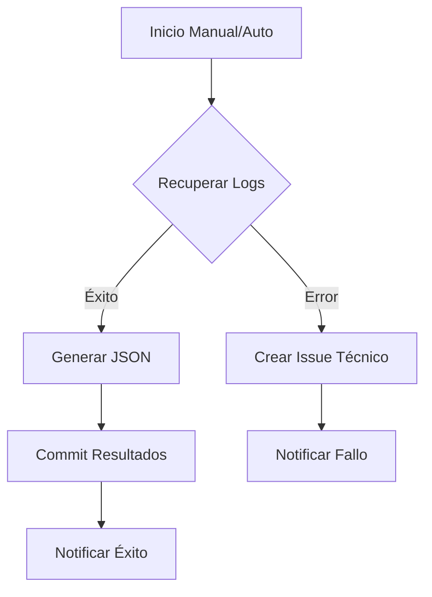

# Módulo Ka0s Inspector - Concepto y Arquitectura

## Descripción General
**Ka0s Inspector** es el "ojo que todo lo ve" dentro del ecosistema Ka0s. Es un workflow de auditoría y supervisión diseñado para extraer inteligencia de las ejecuciones de GitHub Actions, garantizando trazabilidad y transparencia.

## Funcionalidades Clave
1.  **Recuperación de Logs**: Extrae logs crudos de ejecuciones pasadas o en curso.
2.  **Generación de Informes**: Transforma datos no estructurados en JSON procesable.
3.  **Notificaciones Contextuales**:
    *   Si una ejecución falla, crea un Issue técnico con detalles.
    *   Si tiene éxito, actualiza el Issue original con enlaces a los logs.
4.  **Persistencia**: Almacena los resultados en `audit/inspector/` dentro del repositorio, creando un historial inmutable.

## Diagrama de Flujo

