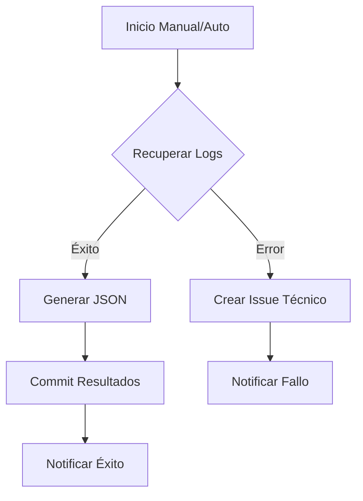

# Módulo Ka0s Inspector - Concepto y Arquitectura

## Descripción General
**Ka0s Inspector** es el "ojo que todo lo ve" dentro del ecosistema Ka0s. Es un workflow de auditoría y supervisión diseñado para extraer inteligencia de las ejecuciones de GitHub Actions, garantizando trazabilidad y transparencia.

## Funcionalidades Clave
1.  **Recuperación de Logs**: Extrae logs crudos de ejecuciones pasadas o en curso.
2.  **Generación de Informes**: Transforma datos no estructurados en JSON procesable.
3.  **Notificaciones Contextuales**:
    *   Si una ejecución falla, crea un Issue técnico con detalles.
    *   Si tiene éxito, actualiza el Issue original con enlaces a los logs.
4.  **Persistencia**: Almacena los resultados en `audit/inspector/` dentro del repositorio, creando un historial inmutable.

## Diagrama de Flujo

## Estándares de Automatización (Ka0s)

Este componente sigue los estándares de automatización y seguridad de Ka0s definidos en `core/templates/workflow/basic-template.yaml`:

- **Identidad**: Define la variable `KAOS_MODULE` en su workflow para trazabilidad unificada en logs y notificaciones.
- **Gestión de Errores**: Implementa un job `handle-failure` que, en caso de fallo, genera automáticamente un **Incidente** en GitHub (y sincronizado con iTop) con etiquetas `itop-incident`, `triage`, `automated`.
- **Auditoría**: Implementa un job `end-workflow` que dispara el workflow `inspector.yml` al finalizar, asegurando que todos los logs y metadatos de ejecución sean auditados y persistidos.
- **Seguridad**: El workflow se ejecuta con permisos mínimos (Least Privilege) y utiliza secretos gestionados de forma segura.
