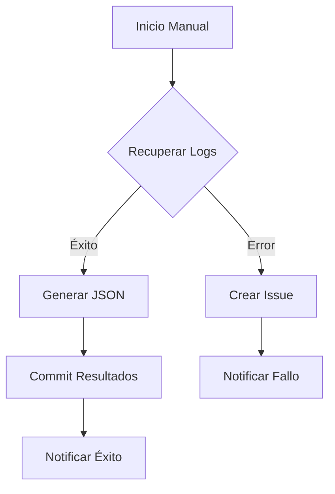

# Módulo Ka0s Inspector

## Descripción General

Workflow de supervisión y auditoría de ejecuciones en GitHub Actions. Funcionalidades principales:

- Recuperación de logs de ejecución
- Generación de informes estructurados en JSON
- Notificaciones automatizadas en issues
- Gestión centralizada de resultados de auditoría

## Arquitectura del Workflow

### Disparadores

```yml
on:
  workflow_dispatch:
    inputs:
      kaos-issue-id: 'ID del issue relacionado'
      kaos-workflow-id: 'ID del workflow monitoreado'
      kaos-user-start: 'Indicador de inicio manual'
```

### Flujo Principal (job-core)

1. Preparación del entorno :

   - Checkout completo del repositorio con token seguro
   - Configuración de identidad bot para commits

2. Recolección de datos :

   - Descarga de logs mediante GH CLI
   - Extracción de metadatos técnicos
   - Formateo JSON de resultados

3. Persistencia de resultados :

   - Commit automatizado de logs e informes
   - Almacenamiento en audit/inspector/

### Mecanismos de Notificación

- Éxito : Actualización del issue original con ubicación de logs
- Fallo : Creación automática de nuevo issue técnico

### Variables Clave

```yml
KAOS_MODULE: "[Ka0S] INSPECTOR"  # Identificador del módulo
KAOS_OUTPUT_EXECUTION: "audit/inspector/"  # Ruta de almacenamiento
KAOS_EXP_FULL_LOGS: "conclusion,createdAt..."  # Campos de metadata
```

## Disgrama de estados



## Políticas de Seguridad

1. Permisos Mínimos :

   - contents: write solo para rutas designadas
   - Token KAOS_REPO_TOKEN con scope restringido

2. Auditoría :

   - Todos los commits firmados por identidad bot
   - Registro histórico inmutable de ejecuciones

3. Protección de Datos :

   - Logs almacenados en ruta privada
   - Metadatos sensibles omitidos en informes

4. Gestión de Errores :

   - Notificaciones sin exposición de datos internos
   - Issues técnicos con etiquetas específicas
