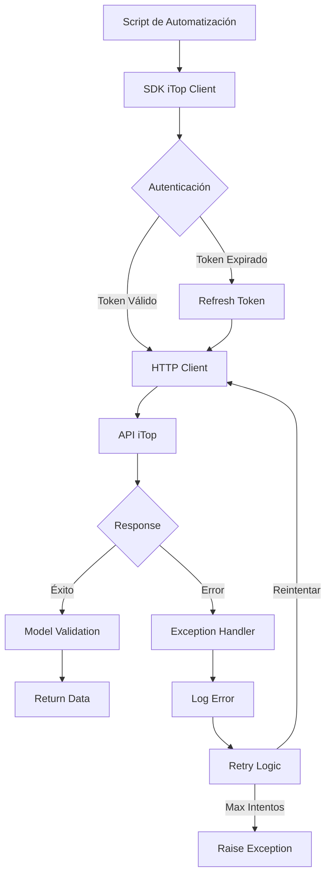

# Arquitectura del SDK Unificado para iTop

## 1. Objetivos

### 1.1 Unificación
- Proporcionar una interfaz única y coherente para interactuar con múltiples endpoints de la API de iTop
- Eliminar la duplicación de código en los scripts de automatización
- Establecer patrones comunes para todas las integraciones con iTop

### 1.2 Robustez
- Implementar manejo robusto de errores con excepciones personalizadas
- Gestionar automáticamente reintentos y circuit breakers
- Validación de datos de entrada y salida

### 1.3 Observabilidad
- Logs estructurados en formato JSON para integración con ELK
- Trazabilidad completa de operaciones con correlation IDs
- Métricas de rendimiento y disponibilidad

## 2. Estructura del SDK

### 2.1 Módulos Principales

```
ka0s_itop_sdk/
├── client/
│   ├── __init__.py
│   ├── http_client.py      # Cliente HTTP con gestión de sesiones
│   └── retry_handler.py    # Lógica de reintentos y circuit breaker
├── session/
│   ├── __init__.py
│   ├── auth_manager.py     # Gestión de autenticación y tokens
│   └── session_manager.py  # Gestión de sesiones y estado
├── models/
│   ├── __init__.py
│   ├── base_model.py       # Modelos base para datos de iTop
│   ├── user.py            # Modelo de usuario
│   ├── organization.py    # Modelo de organización
│   └── ticket.py          # Modelo de tickets
├── utils/
│   ├── __init__.py
│   ├── validators.py      # Validadores de datos
│   ├── formatters.py      # Formateadores de datos
│   └── config_loader.py   # Carga de configuración
└── exceptions/
    ├── __init__.py
    ├── base_exceptions.py   # Excepciones base
    ├── connection_errors.py # Errores de conexión
    └── api_errors.py       # Errores de API
```

### 2.2 Módulo Client
- **http_client**: Cliente HTTP asíncrono con soporte para HTTPS y timeouts configurables
- **retry_handler**: Implementa patrón circuit breaker y backoff exponencial

### 2.3 Módulo Session
- **auth_manager**: Gestiona la autenticación OAuth2 y refresh tokens
- **session_manager**: Mantiene el estado de sesión y gestiona la expiración

### 2.4 Módulo Models
- Modelos Pydantic para validación de datos
- Serialización/deserialización automática
- Documentación inline de campos

### 2.5 Módulo Utils
- Validadores reutilizables para datos comunes
- Formateadores para fechas, IDs, etc.
- Cargador de configuración desde variables de entorno

### 2.6 Módulo Exceptions
- Jerarquía clara de excepciones
- Mensajes descriptivos y códigos de error únicos
- Contexto adicional para debugging

## 3. Diagrama de Flujo



## 4. Manejo de Errores

### 4.1 Excepciones Base
```python
class ItopBaseException(Exception):
    """Excepción base para todas las excepciones del SDK"""
    def __init__(self, message: str, error_code: str, context: dict = None):
        self.message = message
        self.error_code = error_code
        self.context = context or {}
        super().__init__(self.message)
```

### 4.2 Excepciones Específicas

#### ItopConnectionError
- **Uso**: Errores de conexión HTTP, timeouts, DNS
- **Código**: `CONN_001`
- **Contexto**: URL, timeout configurado, intento actual

#### ItopAuthError
- **Uso**: Fallos de autenticación, tokens inválidos
- **Código**: `AUTH_001`
- **Contexto**: Usuario, método de auth, scopes requeridos

#### ItopApiError
- **Uso**: Errores devueltos por la API de iTop
- **Código**: `API_001`
- **Contexto**: Endpoint, parámetros, código de error iTop

### 4.3 Estrategia de Reintentos
- **Máximo 3 intentos** para errores transitorios
- **Backoff exponencial**: 1s, 2s, 4s
- **No reintentar**: Errores 4xx (excepto 429)

## 5. Logging

### 5.1 Formato JSON Estructurado
```json
{
    "timestamp": "2026-03-16T10:30:45.123Z",
    "level": "INFO",
    "correlation_id": "uuid-v4",
    "service": "ka0s_itop_sdk",
    "module": "client.http_client",
    "function": "get",
    "message": "API request initiated",
    "context": {
        "endpoint": "/api/v1/users",
        "method": "GET",
        "timeout": 30,
        "retry_count": 0
    },
    "metadata": {
        "duration_ms": 245,
        "response_size": 1024,
        "status_code": 200
    }
}
```

### 5.2 Niveles de Log
- **DEBUG**: Detalles de implementación, útil para desarrollo
- **INFO**: Eventos significativos del negocio
- **WARNING**: Situaciones anómalas pero recuperables
- **ERROR**: Errores que requieren atención
- **CRITICAL**: Fallos del sistema

### 5.3 Campos Requeridos
- `timestamp`: ISO 8601 con milisegundos
- `correlation_id`: UUID v4 para trazabilidad
- `service`: Identificador del servicio
- `level`: Nivel de severidad
- `message`: Descripción legible

## 6. Seguridad

### 6.1 Gestión de Secretos
- **Variables de entorno**: Todas las credenciales via env vars
- **Prefijo estándar**: `ITOP_` para todas las variables
- **Ejemplos**:
  ```bash
  ITOP_API_URL=https://itop.ka0s.io
  ITOP_CLIENT_ID=ka0s_automation
  ITOP_CLIENT_SECRET=super_secret_key
  ITOP_TIMEOUT=30
  ```

### 6.2 Tokens y Sesiones
- **Almacenamiento temporal**: Solo en memoria durante la ejecución
- **Nunca en logs**: Los tokens se redactan automáticamente
- **Refresh automático**: Implementado en auth_manager

### 6.3 Validación de Entrada
- **Sanitización**: Todos los inputs se validan antes de enviar
- **Longitud máxima**: 4096 caracteres para strings
- **Caracteres prohibidos**: < > & ' " para prevenir inyección

### 6.4 Auditoría
- **Log de accesos**: Todos los accesos se registran con usuario y timestamp
- **Intentos fallidos**: Trackeados para detectar patrones sospechosos
- **Rotación de secretos**: Documentado el proceso de rotación

## 7. Integración con Scripts de Automatización

### 7.1 Ejemplo de Uso
```python
from ka0s_itop_sdk import ItopClient
from ka0s_itop_sdk.exceptions import ItopApiError

async def main():
    client = ItopClient()
    
    try:
        # Obtener usuario por email
        user = await client.users.get_by_email("user@ka0s.io")
        
        # Crear ticket
        ticket = await client.tickets.create({
            "title": "Incidente de prueba",
            "description": "Descripción del incidente",
            "caller_id": user.id
        })
        
        print(f"Ticket creado: {ticket.id}")
        
    except ItopApiError as e:
        print(f"Error de API: {e.message}")
        
if __name__ == "__main__":
    asyncio.run(main())
```

### 7.2 Mejores Prácticas
- Siempre usar context managers para manejar recursos
- Implementar timeout global para scripts largos
- Manejar excepciones específicas antes que generales
- Usar correlation IDs para trazabilidad en logs