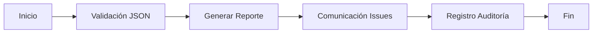

# Módulo Ka0s JSON Lint

## Descripción General

Workflow de GitHub Actions para validación estricta de archivos JSON mediante jsonlint. El proceso incluye:

- Instalación de dependencias
- Análisis estático de JSON
- Gestión de resultados
- Integración con el sistema de issues de GitHub

## Estructura del Workflow

### Disparadores

```yml
on:
  workflow_dispatch:
    inputs:
      kaos-origin: 'ID de ejecución del workflow origen'
      kaos-files: 'Ruta del archivo a validar'
      kaos-issue-id: 'ID del issue relacionado'
      kaos-user-start: 'Indicador de inicio manual'
```

### Flujo Principal (job-core)

- Checkout del código: Utiliza acciones oficiales para obtener el código base
- Instalación de Node.js: Versión 14 para compatibilidad
- Instalación de jsonlint: Instalación global via npm
- Validación JSON:

>- Ejecuta jsonlint con formato legible
>- Genera archivo de resultados
>- Notifica éxito/fallo via comentarios en issues
>- Sube resultados al repositorio

### Manejo de Errores (handle_failure)

- Crea issues nuevos para errores no controlados
- Notifica al issue original con detalles del fallo
- Incluye trazabilidad completa mediante KAOS_CODE

### Variables de Entorno Clave

- KAOS_JSONLINT_CONFIG: Ruta de configuración (core/config/.jsonlint.json)
- KAOS_PATH_RESUME: Directorio de almacenamiento de resultados (audit/jsonlint/)
- KAOS_REF_BRANCH: Rama base para operaciones (main)

## Secuencia de Ejecución

1. Validación inicial del archivo JSON
2. Generación de reporte técnico:
   - Salida de jsonlint
   - Metadatos de versión
   - Contexto de ejecución
3. Comunicación bidireccional con:
   - Sistema de issues
   - Workflows relacionados
   - Registro de auditoría

### Diagrama de Flujo



#### Consideraciones de Seguridad

- Usa token KAOS_REPO_TOKEN con permisos restringidos
- Auditoría completa mediante commits trazables
- Configuración centralizada en .jsonlint.json
