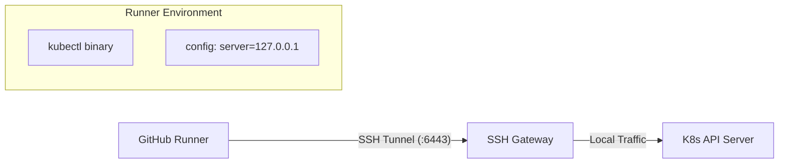

# Concepto y Arquitectura: Ka0s Kubectl Tunnel

## Propósito
El módulo `ka0s_kubectl_tunnel` es una **Action Compuesta** (`.github/actions/kubectl-tunnel`) diseñada para permitir que GitHub Actions interactúe de forma segura con un clúster de Kubernetes privado que no expone su API a internet.

## Problema que Resuelve
Los clústers de Kubernetes en entornos de producción seguros (como Ka0s) suelen tener su API Server (`:6443`) accesible solo desde una red privada o a través de un Bastión SSH. Los runners de CI/CD necesitan ejecutar comandos `kubectl`, pero no tienen acceso directo a esta IP privada.

## Arquitectura de Solución
La acción implementa un patrón de **Túnel SSH con Port Forwarding**:

1.  **Establecimiento del Túnel**: Crea una conexión SSH segura desde el Runner hacia el Bastión/Manager.
2.  **Port Forwarding**: Mapea el puerto local del Runner (ej. `localhost:6443`) al puerto de la API del clúster remoto (a través del túnel).
3.  **Configuración de Kubectl**: Genera un `kubeconfig` temporal que apunta a `https://127.0.0.1:6443`, engañando a `kubectl` para que crea que el clúster es local.
4.  **Instalación de Herramientas**: Descarga e instala `kubectl` oficial automáticamente.

## Diagrama Lógico

