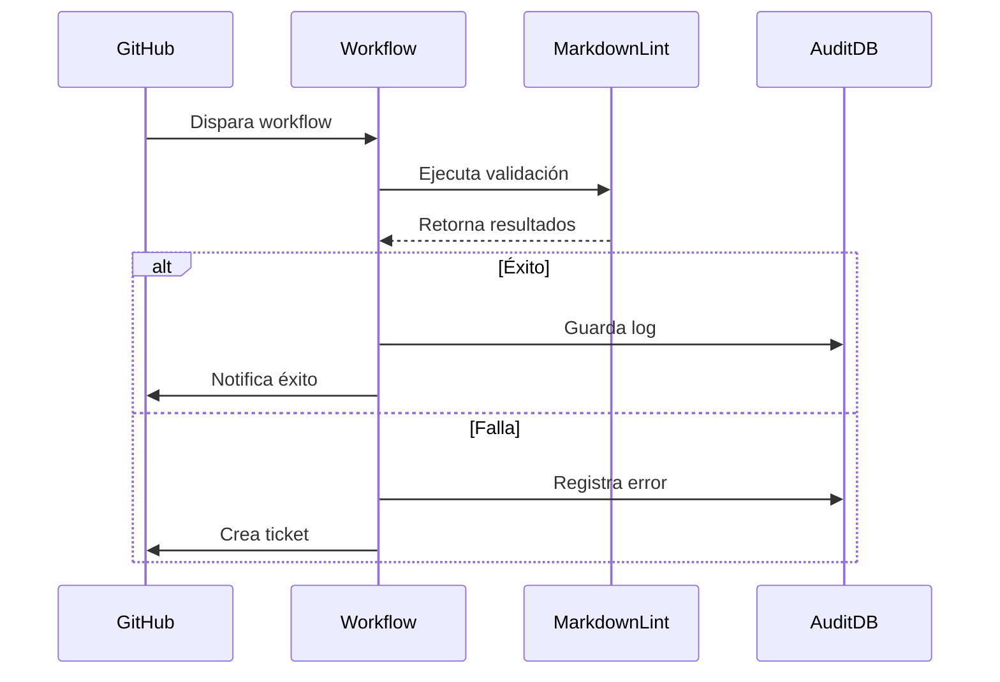

# Módulo Ka0s Markdown Lint

## Descripción General
Workflow especializado en la validación de archivos Markdown usando markdownlint-cli2. Proceso completo incluye:
- Configuración del entorno Node.js
- Análisis de sintaxis Markdown
- Gestión inteligente de errores
- Integración con el sistema de tickets de GitHub

## Arquitectura del Workflow

### Disparadores principales
```yml
on:
  workflow_dispatch:
    inputs:
      kaos-origin: 'ID de ejecución workflow origen'
      kaos-files: 'Ruta absoluta del .md'
      kaos-issue-id: 'Ticket relacionado'
      kaos-user-start: 'Flag de inicio manual'
```

### Núcleo de ejecución (job-core)

1. Preparación del entorno :

   - Checkout del código con token seguro
   - Instalación de Node.js v20
   - Instalación global de markdownlint-cli2

2. Validación avanzada :

   - Ejecución con configuración personalizada (.markdownlint.json)
   - Análisis de resultados mediante expresiones regulares
   - Clasificación automática de errores
   - Notificación contextualizada en tickets

### Mecanismos de fallo (handle_failure)

- Creación automática de tickets con stacktrace
- Trazabilidad completa mediante:
  - KAOS_CODE (ID de ejecución)
  - Registros en audit/mdlint/
  - Relación bidireccional con workflows padres

### Variables críticas

- KAOS_MD_CONFIG : Ruta de configuración (core/config/.markdownlint.json)
- KAOS_PATH_RESUME : Almacenamiento de resultados (audit/mdlint/)
- FILE_ERROR : Buffer de errores no controlados

## Diagrama de proceso



## Políticas de seguridad

- Uso de KAOS_REPO_TOKEN con scope restringido
- Auditoría mediante commits firmados
- Configuración centralizada en .markdownlint.json
- Aislamiento de ejecuciones mediante grupos de runners
