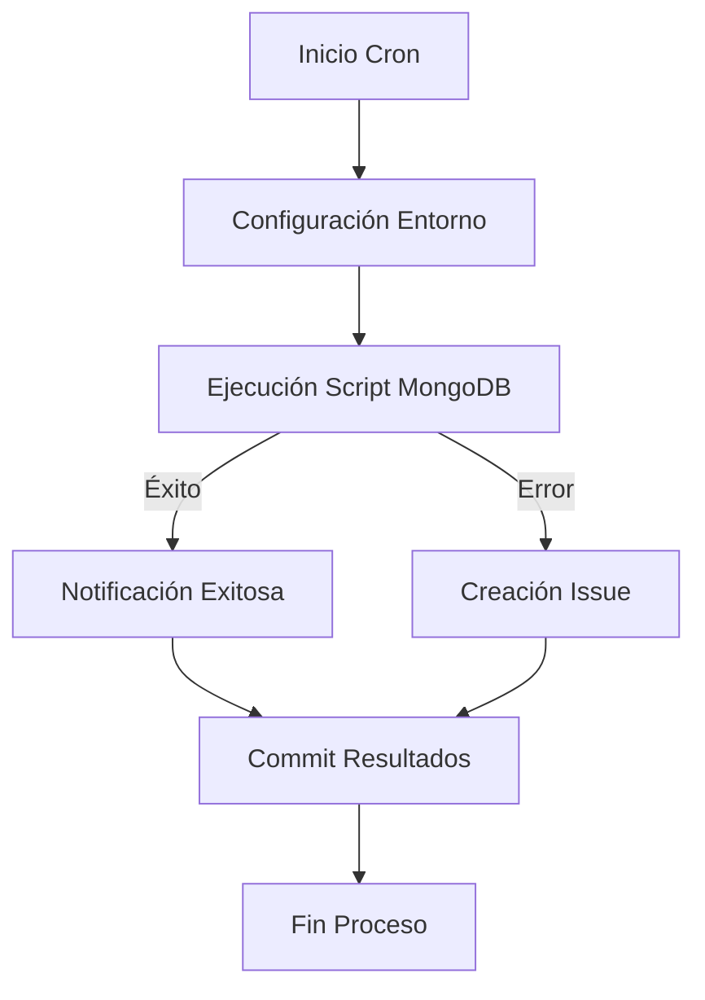

# # Módulo Ka0s MongoDB Integration

## Descripción General

Workflow de GitHub Actions para integración automatizada con MongoDB que:

- Ejecuta actualizaciones horarias programadas
- Gestiona documentos en base de datos NoSQL
- Implementa mecanismos de rollback automático
- Integra con el sistema de issues de GitHub

## Estructura del Workflow

### Disparadores

```yaml
on:
  schedule:
    - cron: '0 * * * *'  # Ejecución cada hora
  workflow_dispatch:     # Activación manual
```

### Flujo Principal (job-core)

- Checkout del código : Usa token seguro con permisos restringidos
- Configuración Python : Versión 3.9 para compatibilidad
- Instalación dependencias : PyMongo para conexión MongoDB
- Ejecución script :
  - Actualización documentos en MongoDB
  - Generación de reportes JSON
  - Commit automatizado de cambios

### Manejo de Éxito (handle-success)

- Notificación de ejecución exitosa
- Integración con comentarios en issues
- Trazabilidad completa mediante KAOS_CODE

### Manejo de Errores (handle_failure)

- Creación automática de issues
- Notificación detallada de fallos
- Registro de errores en auditoría

### Variables Clave

- MONGO_SUPERUSER_CONNECTION : Cadena conexión encriptada
- KAOS_CODE : Identificador único de ejecución
- REPORT_PATH : Ruta de almacenamiento de reportes (audit/mongodb/)

## Diagrama de Flujo



## Políticas de Seguridad

- Uso de credenciales encriptadas via GitHub Secrets
- Permisos mínimos necesarios (escritura en issues)
- Auditoría completa mediante commits firmados
- Rotación automática de tokens de acceso

## Integraciones

- Sistema de issues de GitHub
- Workflow Inspector para monitoreo
- Auditoría centralizada en MongoDB Atlas
