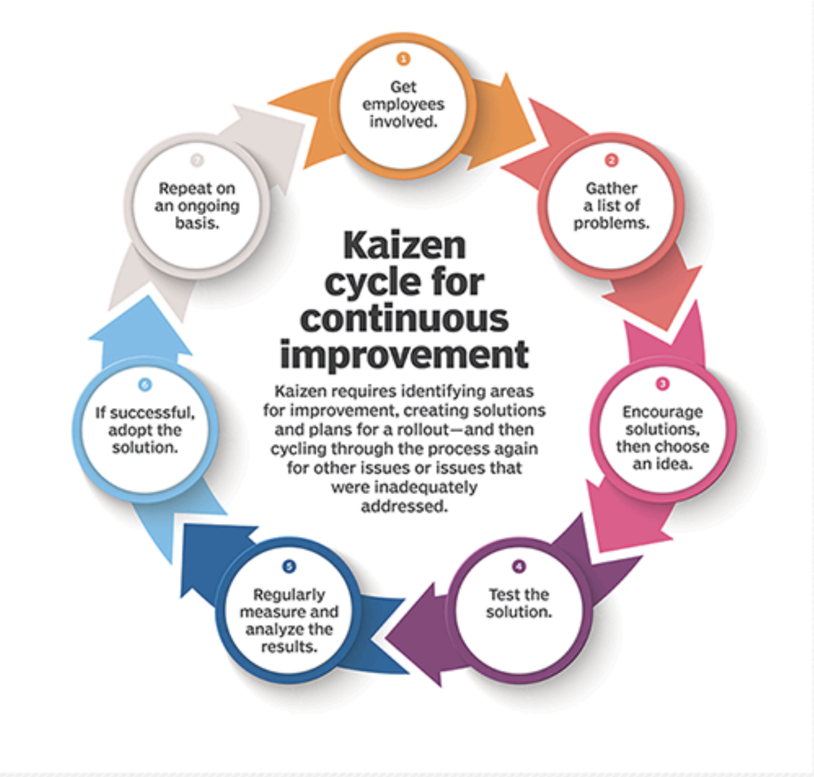
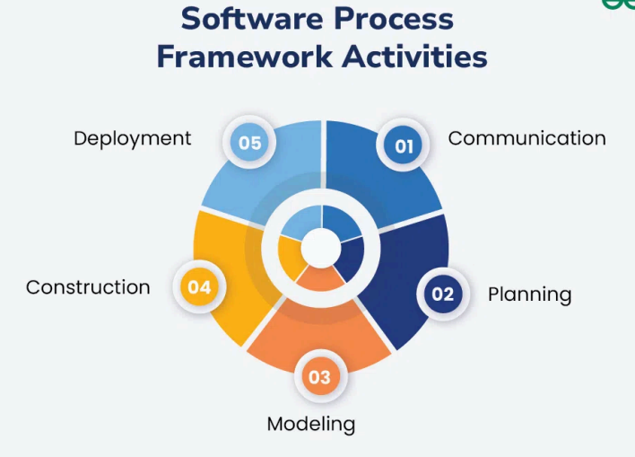
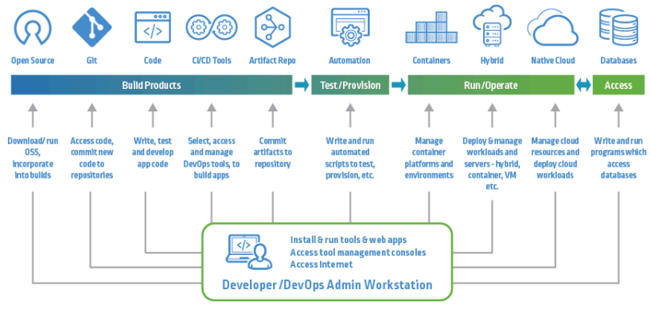
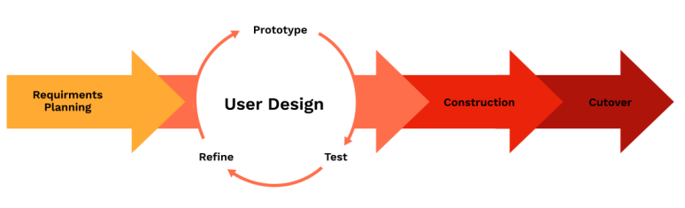
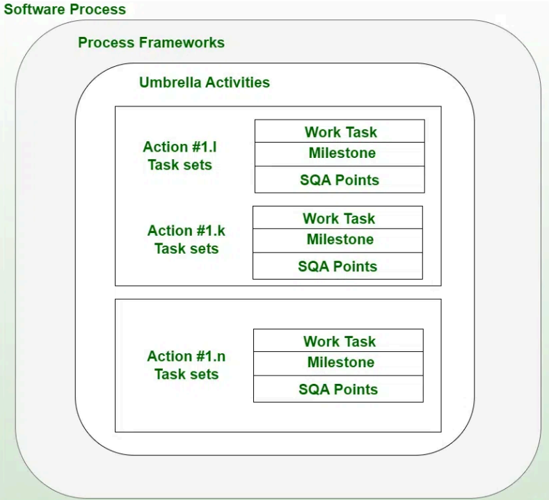
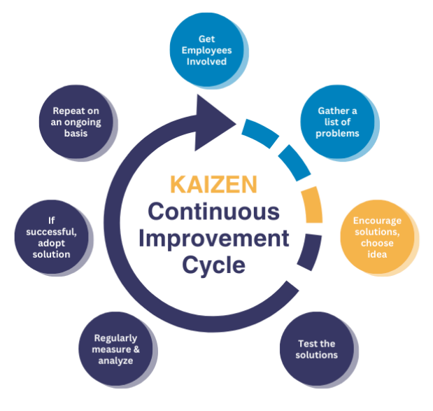

# Ka0s-Klaus release

## ¿Qué es Ka0s Klaus?

Ka0s es un framework de desarrollo de software basado en código que permite a
todos los miembros de una empresa gestionar eficientemente un ecosistema de
herramientas.
Está fundamentado en la metodología Kaizen, una filosofía japonesa de mejora
continua que busca acumular grandes beneficios a largo plazo a través de pequeñas pero constantes mejoras.
Como indica su nombre, inspirado en la teoría del caos, busca encontrar patrones y estructura en sistemas complejos para optimizar su funcionamiento.

## Características Principles

- Metodología única de desarrollo: Diseñada para trabajar en "origin/main" con un único "iniciador" que discrimina los entornos de ejecución.
- Estructura modular: El core de Ka0s gestiona diferentes entornos y "runners" donde se ejecuta el código.
- Sistema de versionado estructurado: PATCH (correcciones), MINOR (ampliaciones) y MAJOR (nuevas funcionalidades).
- Dashboard sencillo: Gestión de solicitudes y registro de cambios mediante un template Kanban (backlog - in progress - done)

## Ventajas de Ka0s Klaus

- Revisión de código continuo: Detección y corrección temprana de errores, mejorando la calidad del código.
- Automatización de pruebas: Asegura que todas las funcionalidades se prueben de manera consistente y eficiente.
- Refactorización Continua: Facilita la mejora constante del código sin afectar su funcionalidad.
- Integración y Entrega Continua (CI/CD): Permite integrar y entregar cambios de manera rápida y segura.
- Retroalimentación y reciclaje del código: Fomenta la mejora continua y la reutilización de componentes

## Cómo Kaos Klaus mejora los números

- Reducción de errores y defectos: Menos tiempo y recursos dedicados a la corrección de errores post-lanzamiento.
- Mayor eficiencia en el desarrollo: Entrega de nuevas funcionalidades y mejoras más rápidamente al mercado.
- Optimización de recursos: Reducción de costos de desarrollo y mantenimiento mediante la reutilización de componentes.
- Mejora de la calidad del producto: Impacto positivo en la satisfacción del cliente y en métricas de negocio como retención y crecimiento.

## Optimización de recursos

- Reutilización de componentes: Reduce la necesidad de desarrollar desde cero, aprovechando el código existente.
- Aceleración del desarrollo: Procesos automatizados que reducen el tiempo de implementación y despliegue.
- Mejora de la productividad: Mayor eficiencia en la gestión de tareas y asignación de recursos.
- Reducción de costos: Menor inversión en corrección de errores y mantenimiento a largo plazo.

## Estandarización y Colaboración

- Reglas comunes para todos: Establece un marco de trabajo unificado que todos los miembros del equipo pueden seguir y entender.
- Colaboración entre equipos: Facilita la comunicación y el trabajo conjunto entre diferentes departamentos y especialidades.
- Reducción de dependencias: Minimiza la dependencia de conocimientos específicos de individuos, reduciendo riesgos operativos.
- Transferencia de conocimiento: Mejora el intercambio de información y experiencia entre los miembros del equipo.

## Conclusiones

"Ka0s transforma el aparente caos del desarrollo de software en un sistema organizado y eficiente mediante la aplicación de principios de mejora continua."

- Framework que optimiza la gestión de herramientas y componentes dentro de una empresa.
- Mejora la eficiencia y calidad del desarrollo de software a través de procesos 100% automatizados.
- Reduce costos y tiempos de desarrollo mediante la reutilización de componentes.
- Impacta positivamente en las métricas de negocio y la satisfacción del cliente.

