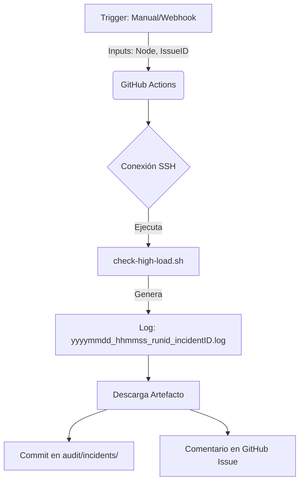

# Ka0s Remediation: High CPU/Load Workflow

Este documento describe la lógica y el uso del flujo de remediación automatizada para incidentes de alta carga en nodos.

## 1. Concepto
El workflow `remediation-high-load.yml` implementa una respuesta táctica ante alertas de saturación de CPU o Load Average. Su objetivo es **diagnosticar** el estado del nodo y **documentar** la evidencia directamente en la Issue correspondiente.

## 2. Flujo de Ejecución

## 3. Entradas (Inputs)
| Parámetro | Descripción | Ejemplo |
| :--- | :--- | :--- |
| `node_name` | Nombre del nodo K8s afectado. | `k8-manager` |
| `issue_number` | ID de la incidencia abierta en GitHub. | `4365` |

## 4. Salidas (Outputs)
1.  **Evidencia Persistente**: Un archivo de log guardado en `audit/incidents/`.
    - Nomenclatura: `YYYYMMDD_HHMMSS_RUNID_INCIDENTID.log`.
2.  **Reporte Inmediato**: Un comentario automático en la Issue con un resumen del diagnóstico (Top procesos, I/O wait).

## 5. Integración con Zabbix (Futuro)
Este workflow está diseñado para ser invocado vía API (`workflow_dispatch`) desde una Acción de Zabbix cuando se dispara el trigger `High CPU Load`.
