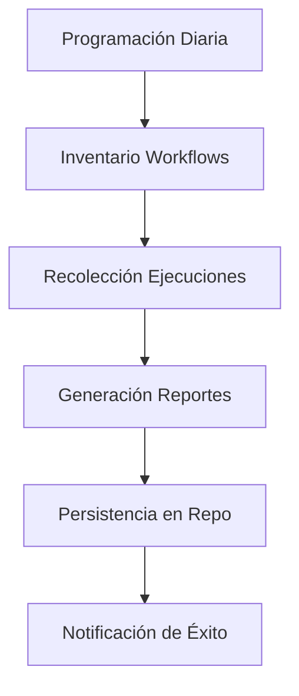

# Módulo Ka0s Workflow Statistics

## Descripción General

Workflow de GitHub Actions para análisis estadístico integral de:

- Ejecuciones de workflows
- Issues del repositorio
- Pull Requests

Funcionalidades clave:

- Recopilación diaria automatizada
- Generación de reportes estructurados (JSON/CSV)
- Integración con GitHub API v4
- Auditoría histórica de actividades

## Arquitectura del Workflow

### Disparadores

```yml
on:
  schedule:
    - cron: '0 0 * * *'  # Ejecución diaria
  workflow_dispatch:      # Activación manual
```

### Flujo Principal (job-stats)

1. Inventario de Workflows :

   - Listado completo de workflows activos
   - Exportación a JSON/CSV

2. Métricas de Ejecución :

   - Recopilación histórica de runs
   - Procesamiento paginado (100 elementos/página)
   - Normalización de zonas horarias

3. Gestión de Issues/PRs :

   - Snapshots del estado actual
   - Metadatos técnicos completos
   - Relaciones cruzadas (milestones, proyectos)

### Variables Clave

```yaml
KAOS_PATH_RESUME: "audit/workflows/"  # Directorio de reportes
GH_REPO: "Ka0s-Klaus/ka0s"           # Repositorio objetivo
KAOS_MODULE: "[Ka0S] Workflow Statistics"
```

## Diagrama de Proceso



## Políticas de Seguridad

1. Control de Accesos :

   - Token con scope write solo en paths designados
   - Autenticación en GitHub API con token temporal

2. Protección de Datos :

   - Ofuscación de metadatos sensibles
   - Exclusión de contenido body en issues

3. Auditoría :

   - Trazabilidad completa mediante KAOS_CODE
   - Commits firmados por identidad bot
   - Registros inmutables en formato timestamp

4. Manejo de Errores :

   - Creación automática de issues técnicos
   - Rollback automático de commits parciales
   - Notificaciones no intrusivas
