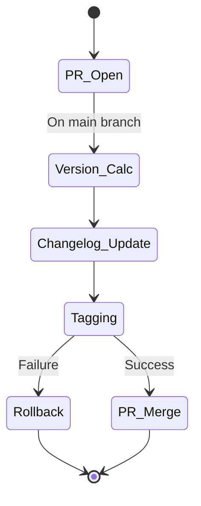

# Módulo Ka0s Version Manager

## Objetivo Principal
Workflow especializado en gestión de versionado semántico automático. Proceso clave incluye:
- Análisis de Pull Requests
- Cálculo de nueva versión
- Actualización de registros históricos
- Tagging de releases

## Arquitectura del Workflow

### Disparadores
```yml
on:
  pull_request:
    types: [opened]
    branches: [main]
```

### Proceso central (job-core)

1. Preparación del entorno :

   - Checkout profundo del repositorio
   - Obtención de metadata del commit
   - Consulta última versión del tag

2. Cálculo de versión :

   - Lógica semántica:
     - Hotfix: Incremento patch
     - Feature: Incremento minor
     - Release: Incremento major

3. Actualización de documentos :

   - CHANGELOG.md con detalles técnicos
   - INDEX.md con referencia rápida
   - Tagging Git con versión calculada

### Mecanismos críticos

- Rollback automático de tags en fallos
- Integración con sistema de issues
- Trazabilidad completa mediante KAOS_CODE

### Variables clave

- GH_VERSION : Versión actual obtenida de tags
- PATH_RESUME : Ubicación de configuración (core/config/)
- KAOS_BRANCH : Tipo de branch detectado (H/F/RN)

## Diagrama de estados



## Políticas de seguridad

- Tags firmados criptográficamente
- Validación de identidad en commits
- Acceso mínimo necesario al token KAOS_REPO_TOKEN
- Auditoría de cambios en registros históricos
