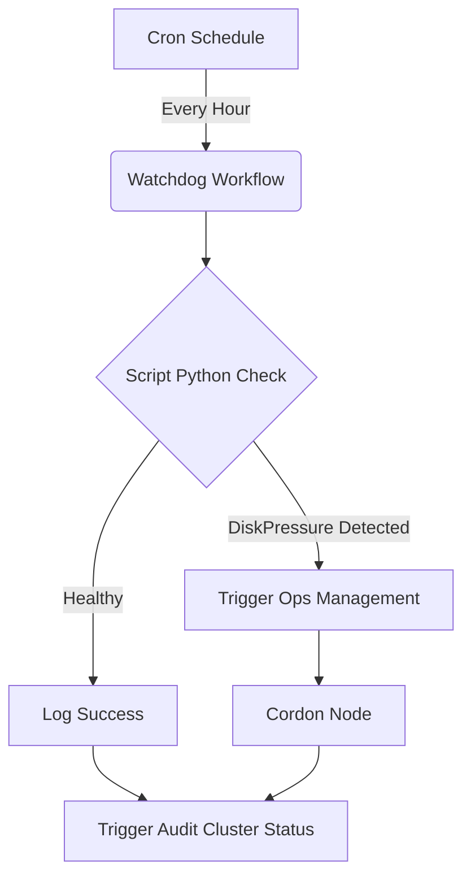

# Concepto: Automatización de la Salud del Cluster

## Filosofía "Self-Healing"

En Ka0s, no esperamos a que un humano detecte un problema crítico de infraestructura. El sistema **Watchdog** implementa el patrón de diseño "Monitor-Actuator":

1.  **Monitor (Sensor)**: Verifica constantemente invariantes del sistema (ej. "Los nodos deben tener espacio en disco").
2.  **Actuator (Executor)**: Ejecuta una acción predefinida e idempotente cuando se viola un invariante.

## Por qué DiskPressure?

La presión de disco es una de las condiciones más peligrosas en Kubernetes. Si un nodo se queda sin espacio:
*   El Runtime de contenedores (containerd) puede fallar.
*   Los logs dejan de escribirse.
*   Kubelet puede dejar de reportar estado.

Aislar el nodo (`cordon`) previene que el Scheduler envíe nuevos Pods a un entorno hostil, conteniendo el "radio de explosión".

## Cadena de Reacción

