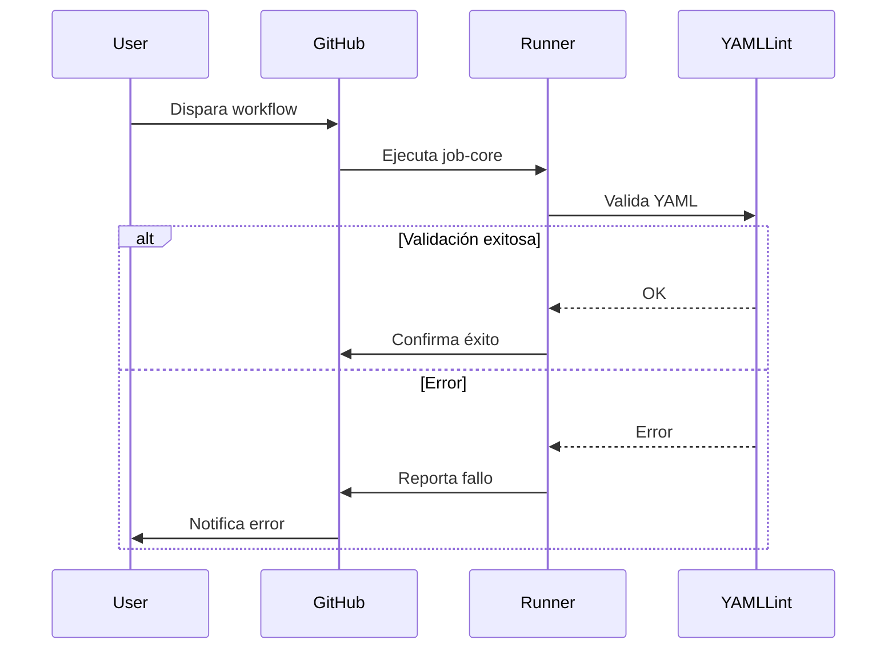

# Módulo Ka0s YAML Lint

## Descripción Global

Workflow especializado en validación de archivos YAML mediante yamllint. Proceso completo incluye:

- Configuración de entorno Python
- Análisis sintáctico YAML
- Gestión de resultados
- Integración con sistema de issues

## Arquitectura del Workflow

### Disparadores principales

```yml
on:
  workflow_dispatch:
    inputs:
      kaos-origin: 'ID workflow origen'
      kaos-files: 'Ruta absoluta del .yml/.yaml'
      kaos-issue-id: 'Ticket relacionado'
      kaos-user-start: 'Inicio manual'
```

### Proceso central (job-core)

1. Preparación del entorno :

   - Checkout seguro con token de acceso
   - Instalación de Python 3.x
   - Instalación de yamllint via pip

2. Validación estricta :

   - Ejecución con configuración personalizada (.yamllint.json)
   - Generación de reporte detallado
   - Clasificación automática de errores
   - Notificación en tickets con contexto técnico

### Manejo de errores críticos

- Creación de tickets con:
  - Stacktrace completo
  - Relación con workflows padres
  - Metadata de ejecución (KAOS_CODE)
- Registro de auditoría en:
  - audit/yamllint/
  - Historial de commits
  
### Variables esenciales

- KAOS_YAMLLINT_CONFIG : Ruta de configuración (core/config/.yamllint.json)
- KAOS_PATH_RESUME : Almacenamiento de logs (audit/yamllint/)
- KAOS_REPO_TOKEN : Token con permisos restringidos

## Diagrama de secuencia


## Políticas de seguridad

- Ejecución en runners aislados
- Uso de identidad digital para commits
- Validación de integridad de logs
- Configuración centralizada protegida
