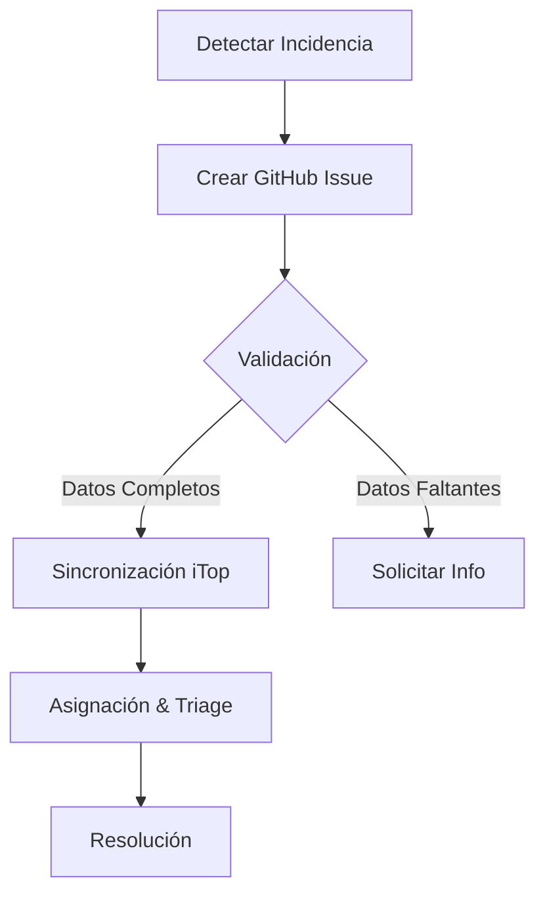

# 🚨 Guía de Uso: Reporte de Incidencias (Incident)

Este documento describe el procedimiento para reportar una **Incidencia Operacional** utilizando la plantilla de GitHub Issues. El objetivo es asegurar que toda la información necesaria se capture correctamente para su sincronización automática con iTop.

!!! info "Sincronización con iTop"
    Al crear este issue, se generará o actualizará automáticamente un ticket de tipo `Incident` en iTop.

## 📋 Flujo del Proceso

## 📝 Campos del Formulario

| Campo | Descripción | Obligatorio | Valores Permitidos |
| :--- | :--- | :---: | :--- |
| **Organización** | Entidad legal afectada. | ✅ | `Ka0s Inc`, `Test 1`, `Test 2` |
| **Solicitante** | Usuario que reporta. Debe existir en CMDB. | ✅ | Email o Login (ej. `@ka0sc0re`) |
| **Estado** | Estado inicial del ticket. | ✅ | `New`, `Assigned`, `Pending`, `Escalated TTO`, `Escalated TTR`, `Resolved`, `Closed` |
| **Impacto** | Alcance de la afectación. | ✅ | `Department`, `Service`, `Person` |
| **Urgencia** | Criticidad del incidente. | ✅ | `critical`, `high`, `medium`, `low` |
| **Servicio / CI** | Elemento de configuración afectado. | ✅ | Ej. `web-frontend`, `DB cluster` |
| **Descripción** | Detalles del síntoma y alcance. | ✅ | Texto libre |
| **Pasos / Evidencias** | Logs, screenshots o pasos para reproducir. | ❌ | Texto libre / Adjuntos |

## 🚀 Mejores Prácticas

1. **Verificación Previa**: Antes de reportar, verifica si ya existe un ticket abierto para el mismo síntoma.
2. **Evidencias**: Adjunta siempre logs o capturas de pantalla en la sección de "Pasos / Evidencias" para acelerar el diagnóstico.
3. **Urgencia Real**: Clasifica la urgencia basándote en el impacto real al negocio, no en la prisa personal.

---
*Generado automáticamente por Ka0s Assistant.*
