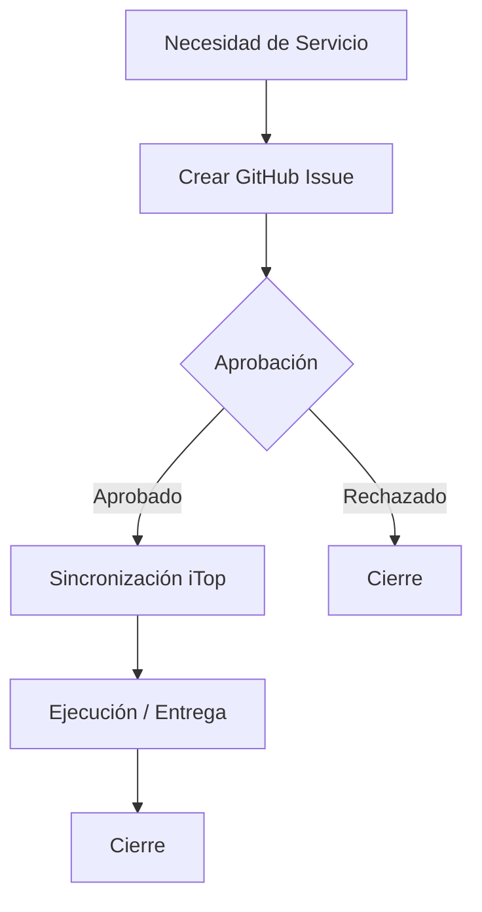

# 🛠️ Guía de Uso: Solicitud de Servicio (Service Request)

Este documento describe el procedimiento para realizar una **Solicitud de Servicio** (petición de soporte, acceso o información) utilizando la plantilla de GitHub Issues.

!!! info "Sincronización con iTop"
    Al crear este issue, se generará o actualizará automáticamente un ticket de tipo `UserRequest` en iTop.

## 📋 Flujo del Proceso

## 📝 Campos del Formulario

| Campo | Descripción | Obligatorio | Valores Permitidos |
| :--- | :--- | :---: | :--- |
| **Organización** | Entidad solicitante. | ✅ | `Ka0s Inc`, `Test 1`, `Test 2` |
| **Solicitante** | Usuario beneficiario (si aplica). | ❌ | Email o Login (ej. `@ka0sc0re`) |
| **Origen** | Canal de entrada. | ✅ | `Portal` |
| **Descripción** | Detalle de lo que se solicita. | ✅ | Texto libre |
| **Impacto** | Alcance de la solicitud. | ✅ | `Department`, `Service`, `Person` |
| **Urgencia** | Prioridad de atención. | ✅ | `critical`, `high`, `medium`, `low` |

## 💡 Consejos

- **Claridad**: Sé específico en la descripción de lo que necesitas (ej. "Acceso de lectura al repo X" en lugar de "Permisos").
- **Solicitante**: Si pides algo para otra persona, especifícalo en el campo "Solicitante".

---
*Generado automáticamente por Ka0s Assistant.*
